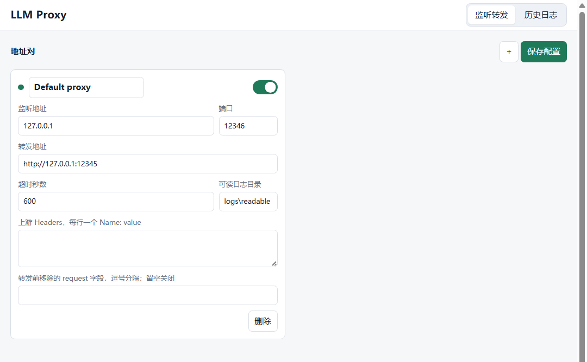
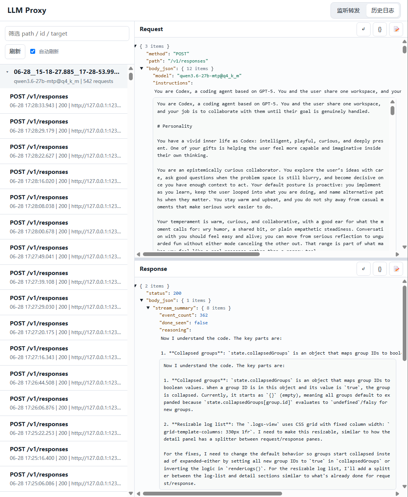

# LLM Proxy

English | [中文](README.cn.md)

LLM Proxy 是一个本地 HTTP 代理，用于转发并记录 Agent 与 OpenAI-compatible LLM API 之间的完整交互。上游可以是本地 `llama.cpp` server，也可以是 OpenRouter、OpenAI-compatible 网关等远程 API。内置 Web UI 支持多代理管理、日志浏览和搜索。

## 主要功能

- 监听本地端口，默认 `127.0.0.1:1234`。
- 转发到上游 LLM API，默认 `http://127.0.0.1:1235`。
- 支持 `GET`、`POST`、`PUT`、`PATCH`、`DELETE`、`OPTIONS`、`HEAD`。
- 记录请求和响应的 headers、body、状态码、耗时、客户端地址和目标地址。
- 写入人工可读 Markdown/JSON 日志。
- 按任务聚合多轮请求，方便回看同一次 Agent 工作流。
- 对 OpenAI-compatible SSE 流式响应生成紧凑摘要，同时保留原始完整流数据。
- 默认在转发前移除部分顶层采样参数，例如 `temperature`、`top_p`、`seed` 等。
- 内置 Web UI（默认 `http://127.0.0.1:8088`），支持多代理管理和日志浏览。

## 工程结构

```text
llm_proxy/
  __init__.py       # 包导出，保留常用 API
  __main__.py       # python -m llm_proxy 入口
  cli.py            # 命令行参数和服务启动
  constants.py      # 共享常量
  http_utils.py     # HTTP header 辅助函数
  logger.py         # 可读日志写入
  manager.py        # 多代理对管理和配置持久化
  payloads.py       # body 编码、解析和渲染
  records.py        # 请求/响应记录分析和任务指纹
  sanitize.py       # 请求字段清洗
  server.py         # HTTP proxy server 和 handler
  streams.py        # SSE 流式响应压缩摘要
  target.py         # 上游地址解析和路径拼接
  time_utils.py     # 日志时间格式化工具
  ui.py             # Admin Web UI（代理管理 + 日志浏览器）
tests/
  test_proxy.py     # 单元测试
examples/
  responses_client.py
proxy.py            # 兼容旧用法的入口脚本
pyproject.toml      # Python 项目元数据和 console script
```

## 快速开始

代理本地 `llama.cpp`：

```powershell
python -m llm_proxy
```

旧入口依然可用：

```powershell
python proxy.py
```

启动内置 Web UI，支持多代理管理：

```powershell
python -m llm_proxy --ui
```

代理远程 OpenAI-compatible API：

```powershell
python -m llm_proxy --target-url https://openrouter.ai/api/v1
```

如需固定注入上游 header：

```powershell
python -m llm_proxy `
  --target-url https://openrouter.ai/api/v1 `
  --target-header "Authorization: Bearer sk-or-..." `
  --target-header "HTTP-Referer: http://localhost" `
  --target-header "X-Title: LLM Proxy"
```

客户端或 Agent 的 base URL 指向：

```text
http://127.0.0.1:1234
```

## Web UI

使用 `--ui` 启动时，代理会提供一个管理界面（默认 `http://127.0.0.1:8088`，可通过 `--ui-host` 和 `--ui-port` 配置）。UI 支持以下功能：

- **代理管理**：添加、编辑、启用/禁用、删除多个 listen/target 对，配置持久化到 JSON 文件（默认 `logs/proxies.json`）。
- **日志浏览器**：浏览所有记录的交互，支持按方法、路径、状态码、目标 URL、任务 ID 搜索。日志在检测到同一任务时会自动分组。
- **请求/响应详情查看**：内联查看完整的请求/响应 body、headers 和流式摘要。

### 界面截图

监听转发管理界面：



历史记录与日志浏览：



## 日志

默认日志位置：

- 可读日志：`logs/readable/`
- 代理配置：`logs/proxies.json`

每次请求会生成一个独立目录，包含：

- Markdown 摘要
- `request.json`
- `response.json`

可识别为同一任务的请求还会额外归档到：

```text
logs/readable/tasks/
```

如果响应是 SSE 流，`response.json` 会显示聚合后的 `stream_summary`，包括 `content`、`reasoning`、`tool_calls`、`finish_reasons`、`usage` 等字段。

## 请求清洗

默认会在转发给上游前移除这些顶层 JSON 字段：

```text
temperature, top_p, top_k, min_p, typical_p, repeat_penalty,
presence_penalty, frequency_penalty, seed
```

自定义要移除的字段：

```powershell
python -m llm_proxy --strip-request-fields "temperature,top_p"
```

关闭请求清洗：

```powershell
python -m llm_proxy --strip-request-fields ""
```

如果发生清洗，日志会记录：

- `request.stripped_fields`
- `request.upstream_body`

## 常用配置

命令行参数和环境变量：

- `--listen-host` / `LLM_PROXY_HOST`
- `--listen-port` / `LLM_PROXY_PORT`
- `--target-url` / `LLM_PROXY_TARGET_URL`
- `--target-scheme` / `LLM_PROXY_TARGET_SCHEME`
- `--target-host` / `LLM_PROXY_TARGET_HOST`
- `--target-port` / `LLM_PROXY_TARGET_PORT`
- `--target-header`
- `--log-file` / `LLM_PROXY_LOG_FILE`（已废弃，不再写入 JSONL 日志）
- `--readable-log-dir` / `LLM_PROXY_READABLE_LOG_DIR`
- `--timeout` / `LLM_PROXY_TIMEOUT`
- `--strip-request-fields` / `LLM_PROXY_STRIP_REQUEST_FIELDS`
- `--access-log` / `LLM_PROXY_ACCESS_LOG=1`
- `--ui` / `LLM_PROXY_UI=1`（启用内置 Web 管理界面）
- `--ui-host` / `LLM_PROXY_UI_HOST`（默认：`127.0.0.1`）
- `--ui-port` / `LLM_PROXY_UI_PORT`（默认：`8088`）
- `--config-file` / `LLM_PROXY_CONFIG_FILE`（代理对配置文件路径，默认：`logs/proxies.json`）

`--target-url` 的优先级高于 `--target-scheme`、`--target-host` 和 `--target-port`。

## 测试

```powershell
python -m unittest discover -s tests
```
