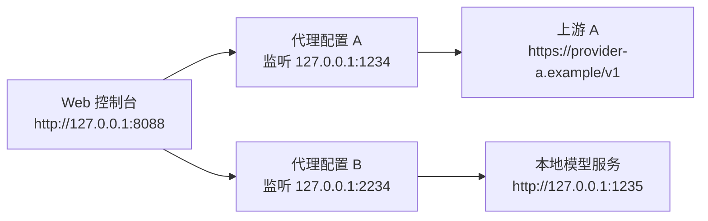
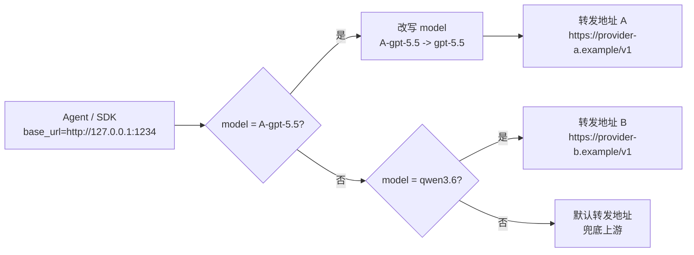
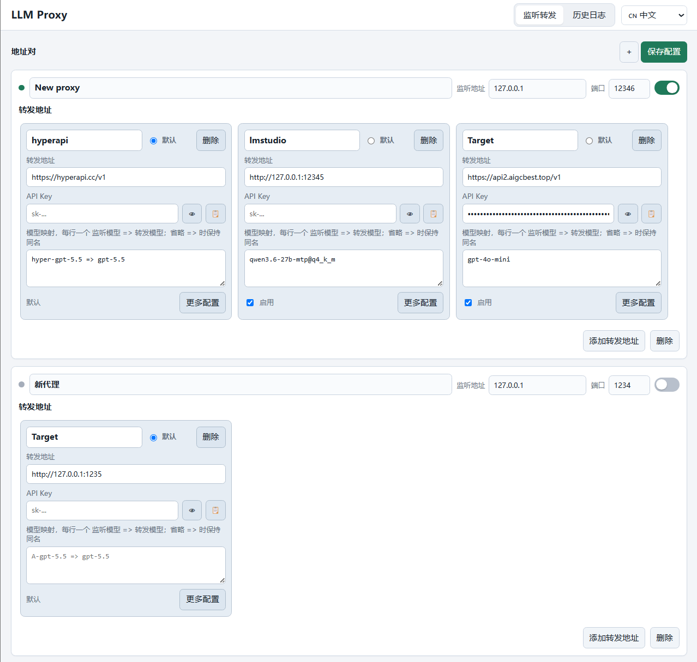
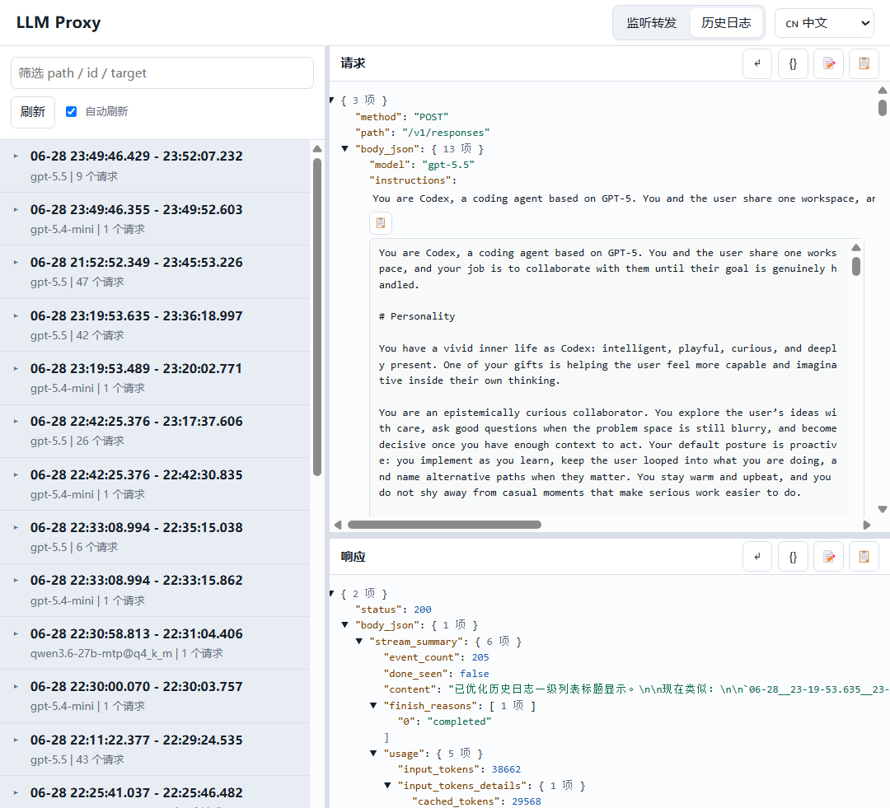

# LLM Proxy

[English](README.md) | 中文

LLM Proxy 是一个以 Web 控制台为核心的本地 LLM 代理管理工具。它可以创建一个或多个本地代理入口，并按请求里的模型名称把同一个入口路由到一个或多个 OpenAI-compatible 上游 API，在浏览器中查看完整的请求、响应和任务历史。

当前项目的主要使用方式已经从命令行参数切换到 UI 界面。命令行主要负责启动服务和兼容旧脚本；日常配置、启停代理、查看日志、搜索历史、检查请求响应内容，都推荐在内置 Web UI 中完成。

## 代理和路由示意

一个 Web 控制台可以管理多个本地监听入口。每个监听入口既可以作为普通的一对一代理，也可以根据请求模型路由到多个不同上游。



在同一个监听入口内部，代理会读取顶层 JSON `model` 字段来选择转发地址。命中的转发地址可以在发给上游前改写模型名；没有匹配到的请求会走默认转发地址。



每个转发地址都有自己的超时、可读日志目录、上游 headers 和 request 字段改写规则。非默认转发地址可以临时关闭，关闭后不会参与模型匹配。

## 核心功能

- 在一个 Web 界面中管理多个本地代理配置。
- 每个本地代理配置拥有一个监听地址和端口，并可添加多个上游转发地址。
- 根据顶层 JSON `model` 字段把请求路由到不同上游。
- 支持按上游改写模型名称，例如本地接收 `A-gpt-5.5`，转发时改成 `gpt-5.5`。
- 每个代理配置可设置默认转发地址，用于处理未匹配到模型映射的请求。
- 非默认转发地址可以临时关闭，不需要删除配置。
- 将 OpenAI-compatible 请求转发到本地或远程上游，例如 `llama.cpp`、OpenRouter 或其他兼容网关。
- 记录完整请求和响应，包括 headers、body、状态码、耗时、客户端地址、目标地址和流式响应摘要。
- 在 UI 中浏览历史日志，并按 path、method、status、target、record id、task id 搜索。
- 自动把相关的多轮 Agent 请求归并为任务，方便回看一次完整工作流。
- 以左右分栏查看 request/response JSON，支持换行、展开折叠、字符串格式化和复制。
- 可在转发前移除或注入顶层 JSON request 字段。
- 默认将代理配置持久化到 `logs/proxies.json`。

## 快速开始

启动 Web 控制台：

```powershell
python -m llm_proxy --ui
```

Windows 下也可以直接运行：

```powershell
.\run.bat
```

服务启动后会自动打开浏览器：

```text
http://127.0.0.1:8088
```

在 UI 中：

1. 打开 **监听转发** 页面。
2. 新增或编辑一个代理地址对。
3. 设置本地监听地址，例如 `127.0.0.1:1234`。
4. 添加一个或多个上游转发地址，例如 `http://127.0.0.1:1235` 或 `https://openrouter.ai/api/v1`。
5. 为每个转发地址按需填写模型映射，例如 `A-gpt-5.5 => gpt-5.5`。
6. 选择默认转发地址，用于处理没有匹配到模型映射的请求。
7. 打开代理开关。
8. 将 Agent 或 SDK 的 base URL 指向本地代理地址。

默认代理地址为：

```text
http://127.0.0.1:1234
```

## Web 控制台

管理界面默认运行在 `http://127.0.0.1:8088`。如需修改管理界面的监听地址，可使用 `--ui-host` 和 `--ui-port`。

### 监听转发

**监听转发** 页面是主要操作入口。每个代理地址对包含：

- 名称、启用状态和运行状态。
- 监听 host 和端口。
- 一个或多个上游转发地址，横向排列在同一个代理配置中。
- 一个默认转发地址，用于处理未匹配到模型的请求。

每个上游转发地址包含：

- 启用状态。默认转发地址始终可用；非默认地址可以关闭。
- 上游目标 URL。
- API Key；如果设置，会添加或替换转发请求中的 `Authorization: Bearer ...`。
- 模型映射，每行一个。格式为 `监听模型 => 转发模型`；如果省略 `=> 转发模型`，则保持同名转发。
- 超时时间。
- 日志目录，默认 `logs`。
- 上游 headers，每行一个 `Name: value`。
- 转发前需要移除的 request 字段。
- 转发前需要注入的 request 字段，格式为 JSON object。

默认情况下，每个转发地址显示 URL、API Key 和模型映射。点击转发地址块里的 **更多配置** 可展开超时、日志目录、headers 和 request 字段改写选项。

代理地址对默认保存到 `logs/proxies.json`，也可以通过 `--config-file` 指定其他配置文件。



### 模型路由

代理收到请求后，会读取顶层 JSON `model` 字段，并按顺序检查已启用的上游转发地址。如果某个转发地址配置了匹配的模型映射，请求会转发到该地址；如果映射里指定了不同的转发模型名，代理会在转发前改写请求里的 `model`。

如果所有已启用的非默认转发地址都没有匹配，请求会转发到默认地址。没有可读取 JSON `model` 字段的请求也会走默认地址。

模型映射示例：

```text
A-gpt-5.5 => gpt-5.5
qwen-local => qwen3
fallback-model
```

最后一行表示监听并转发同名模型 `fallback-model`。

### 历史日志

**历史日志** 页面用于查看已经捕获的流量，不需要手动打开日志文件。它支持：

- 自动刷新。
- 按 method、path、status、target URL、task id、record id 搜索。
- 对相关 Agent 工作流进行任务分组。
- 左右分栏查看 request 和 response 详情。
- JSON 展开/折叠、自动换行、字符串内容格式化和复制。



## 常见使用流程

### 查看本地模型服务请求

1. 启动本地上游服务，例如运行在 `http://127.0.0.1:1235` 的 `llama.cpp` server。
2. 运行 `python -m llm_proxy --ui`。
3. 在 UI 中启用一个从 `127.0.0.1:1234` 到 `http://127.0.0.1:1235` 的代理地址对。
4. 将客户端 base URL 设置为 `http://127.0.0.1:1234`。
5. 打开 **历史日志** 查看捕获到的交互。

### 一个本地入口路由多个模型

1. 创建一个监听 `127.0.0.1:1234` 的代理配置。
2. 添加转发地址 A，例如 `https://provider-a.example/v1`，模型映射填写 `A-gpt-5.5 => gpt-5.5`。
3. 添加转发地址 B，例如 `https://provider-b.example/v1`，模型映射填写 `B-qwen => qwen3`。
4. 设置其中一个转发地址为默认地址。
5. 将客户端指向 `http://127.0.0.1:1234`；代理会根据请求里的 `model` 自动路由。

### 查看远程网关请求

1. 创建代理地址对，将 target URL 设置为 `https://openrouter.ai/api/v1` 或其他 OpenAI-compatible 地址。
2. 在转发地址块的 **API Key** 中填写上游 key，例如 `sk-or-...`。
3. 启用代理地址对。
4. 将本地客户端指向该代理的监听地址。

### 统一或修正请求参数

不同上游对采样参数的支持可能不同。可以在转发地址块的 **更多配置** 中使用 **转发前移除的 request 字段** 删除顶层 JSON 字段，例如：

```text
temperature, top_p, top_k, min_p, typical_p, repeat_penalty,
presence_penalty, frequency_penalty, seed
```

也可以使用 **转发前注入的 request 字段** 增加或覆盖顶层 JSON 字段，例如：

```json
{"metadata":{"source":"llm-proxy"},"stream":true}
```

当请求被改写时，日志会记录 `request.stripped_fields`、`request.injected_fields` 和 `request.upstream_body`。

## 磁盘日志

默认路径：

- 代理配置：`logs/proxies.json`
- 可读交互日志：默认 `logs/readable/`，可按转发地址单独配置日志根目录
- 按任务归档的日志：`logs/tasks/`

每次捕获到的交互都会写入独立目录，包含：

- Markdown 摘要。
- `request.json`。
- `response.json`。

对于 OpenAI-compatible SSE 流式响应，`response.json` 会在保留原始流数据的同时写入聚合后的 `stream_summary`，其中可能包含 `content`、`reasoning`、`tool_calls`、`finish_reasons`、`usage` 等字段。

## 命令行兼容模式

如果已有脚本依赖单代理命令行模式，仍然可以继续使用：

```powershell
python -m llm_proxy
```

旧入口也仍然保留：

```powershell
python proxy.py
```

指定远程上游：

```powershell
python -m llm_proxy --target-url https://openrouter.ai/api/v1
```

注入固定上游 headers：

```powershell
python -m llm_proxy `
  --target-url https://openrouter.ai/api/v1 `
  --target-api-key "sk-or-..." `
  --target-header "HTTP-Referer: http://localhost" `
  --target-header "X-Title: LLM Proxy"
```

命令行模式也支持请求改写：

```powershell
python -m llm_proxy --strip-request-fields "temperature,top_p"
python -m llm_proxy --inject-request-fields '{"metadata":{"source":"proxy"},"stream":true}'
```

## 配置参考

常用启动参数和环境变量：

- `--ui` / `LLM_PROXY_UI=1`
- `--ui-host` / `LLM_PROXY_UI_HOST`，默认 `127.0.0.1`
- `--ui-port` / `LLM_PROXY_UI_PORT`，默认 `8088`
- `--config-file` / `LLM_PROXY_CONFIG_FILE`，默认 `logs/proxies.json`
- `--readable-log-dir` / `LLM_PROXY_READABLE_LOG_DIR`，默认 `logs`
- `--listen-host` / `LLM_PROXY_HOST`
- `--listen-port` / `LLM_PROXY_PORT`
- `--target-url` / `LLM_PROXY_TARGET_URL`
- `--target-scheme` / `LLM_PROXY_TARGET_SCHEME`
- `--target-host` / `LLM_PROXY_TARGET_HOST`
- `--target-port` / `LLM_PROXY_TARGET_PORT`
- `--target-api-key` / `LLM_PROXY_TARGET_API_KEY`
- `--target-header`
- `--timeout` / `LLM_PROXY_TIMEOUT`
- `--strip-request-fields` / `LLM_PROXY_STRIP_REQUEST_FIELDS`
- `--inject-request-fields` / `LLM_PROXY_INJECT_REQUEST_FIELDS`
- `--access-log` / `LLM_PROXY_ACCESS_LOG=1`

在单代理命令行模式下，`--target-url` 的优先级高于 `--target-scheme`、`--target-host` 和 `--target-port`。

## 工程结构

```text
llm_proxy/
  __main__.py       # python -m llm_proxy 入口
  cli.py            # 启动器、UI 启动和兼容 CLI 模式
  ui.py             # 内置 Web 控制台和管理 API
  manager.py        # 多代理管理和配置持久化
  server.py         # HTTP 代理服务和 handler
  logger.py         # Markdown/JSON 可读日志写入
  records.py        # 请求/响应分析和任务指纹
  streams.py        # SSE 流式响应摘要
  sanitize.py       # request 字段移除/注入
  target.py         # 上游 URL 解析和路径拼接
  payloads.py       # body 编码、解析和渲染辅助
tests/
  test_proxy.py
doc/
  ui_proxy_cn.png
  ui_logs_cn.png
proxy.py            # 旧入口脚本
run.bat             # Windows UI 启动脚本
pyproject.toml
```

## 测试

```powershell
python -m unittest discover -s tests
```
