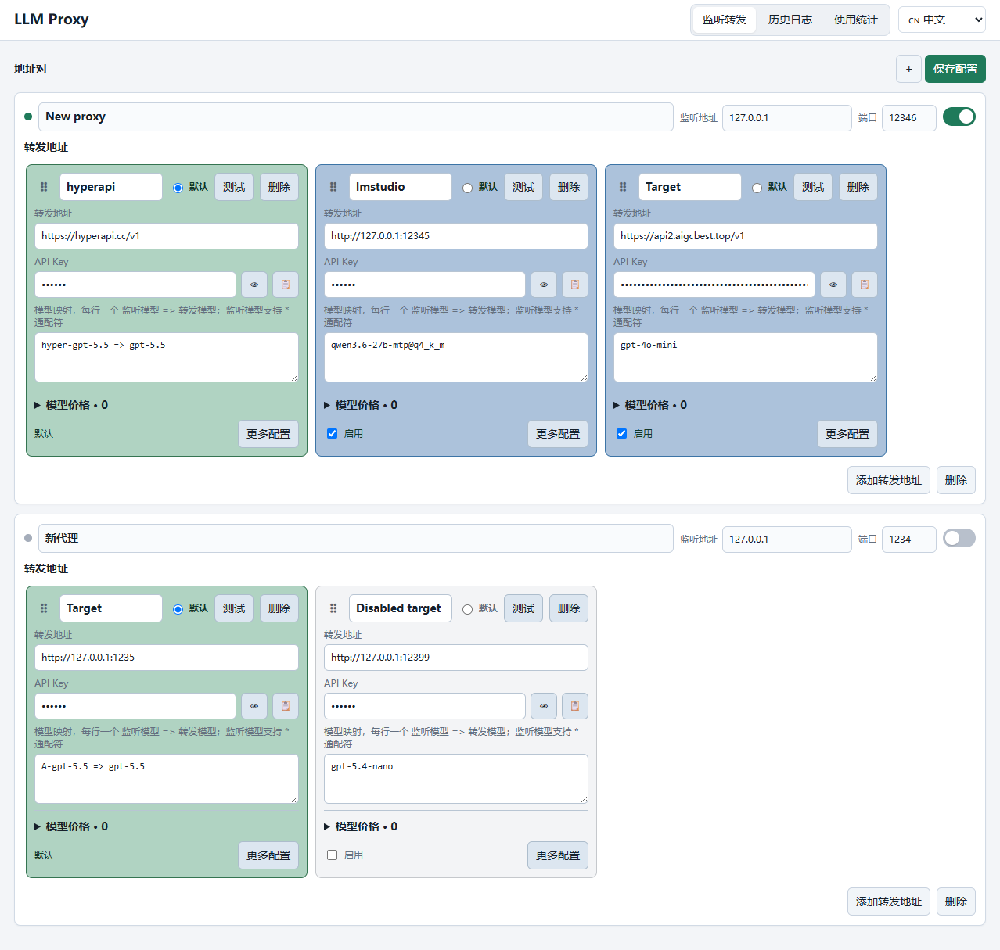
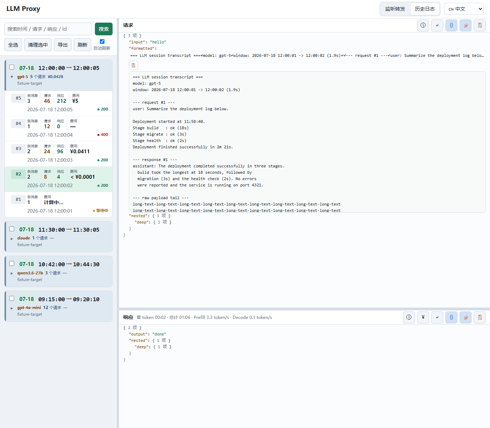
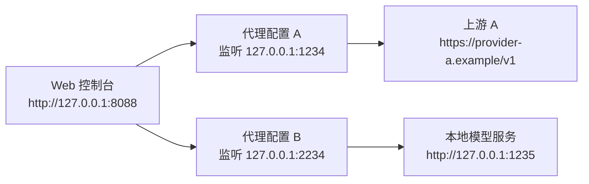
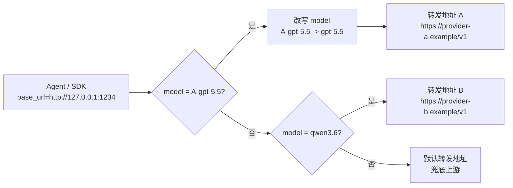

# LLM Proxy

[English](README.md) | 中文

LLM Proxy 是一个以 Web 控制台为核心的本地 LLM 代理管理工具。你可以创建一个或多个本地代理入口，按请求里的模型名称把同一个入口路由到一个或多个 OpenAI-compatible 或 Claude Messages 风格的上游 API，并在浏览器中查看完整的请求、响应和任务历史。

当前项目以 Web UI 作为主要使用方式。命令行主要负责启动管理界面；日常配置、启停代理、查看日志、搜索历史、导出流量、检查请求响应内容，都在内置 Web UI 中完成。





## 代理和路由示意

一个 Web 控制台可以管理多个本地监听入口。每个监听入口既可以作为普通的一对一代理，也可以根据请求模型路由到多个不同上游。


```mermaid
flowchart LR
  UI["Web 控制台<br/>http://127.0.0.1:8088"] --> P1["代理配置 A<br/>监听 127.0.0.1:1234"]
  UI --> P2["代理配置 B<br/>监听 127.0.0.1:2234"]
  P1 --> A1["上游 A<br/>https://provider-a.example/v1"]
  P2 --> B1["本地模型服务<br/>http://127.0.0.1:1235"]
```

在同一个监听入口内部，代理会读取顶层 JSON `model` 字段来选择转发地址。命中的转发地址可以在发给上游前改写模型名；没有匹配到的请求会走默认转发地址。


```mermaid
flowchart LR
  Client["Agent / SDK<br/>base_url=http://127.0.0.1:1234"] --> MatchA{"model = A-gpt-5.5?"}
  MatchA -- 是 --> RewriteA["改写 model<br/>A-gpt-5.5 -> gpt-5.5"]
  RewriteA --> UpstreamA["转发地址 A<br/>https://provider-a.example/v1"]
  MatchA -- 否 --> MatchB{"model = qwen3.6?"}
  MatchB -- 是 --> UpstreamB["转发地址 B<br/>https://provider-b.example/v1"]
  MatchB -- 否 --> Default["默认转发地址<br/>兜底上游"]
```

每个转发地址都有自己的超时、日志目录、上游 headers 和 request 字段改写规则。非默认转发地址可以临时关闭，关闭后不会参与模型匹配。

## 核心功能

- 在一个 Web 界面中管理多个本地代理配置。
- 每个本地代理配置拥有一个监听地址和端口，并可添加多个上游转发地址。
- 根据顶层 JSON `model` 字段把请求路由到不同上游。
- 支持按上游改写模型名称，例如本地接收 `A-gpt-5.5`，转发时改成 `gpt-5.5`。
- 每个代理配置可设置默认转发地址，用于处理未匹配到模型映射的请求。
- 非默认转发地址可以临时关闭，不需要删除配置。
- 将 OpenAI-compatible 请求和 Anthropic/Claude 风格的 `/v1/messages` 请求转发到本地或远程上游，例如 `llama.cpp`、OpenRouter 或其他兼容网关。
- 记录完整请求和响应，包括 headers、body、状态码、耗时、客户端地址、目标地址和流式响应摘要。
- 在 UI 中浏览历史日志，并按 path、method、status、target、record id、task id 搜索。
- 自动把相关的多轮 Agent 请求归并为任务，方便回看一次完整工作流，包括 Claude Messages 多轮对话。
- 以左右分栏查看 request/response JSON，支持换行、展开折叠、字符串格式化和复制。
- 可在转发前移除或注入顶层 JSON request 字段。
- 可选对保存日志中的敏感 headers 和常见 JSON 密钥字段脱敏。
- 可将任务日志导出为 ZIP，并清理用户选中的任务组。
- 默认将代理配置持久化到 `logs/proxies.json`。

## 快速开始

启动 Web 控制台：

```powershell
npm ci
npm run build
npm start
```

需要 Node.js 24。浏览器默认自动打开 `http://127.0.0.1:8088`；无浏览器启动可使用
`npm start -- --no-browser`。

### Windows 托盘应用

可以从 GitHub Release 下载 installer 或 portable 版本。在 Windows 本机构建两个版本：

```powershell
npm ci
npm run package:electron
```

启动后会在系统托盘显示 LLM Proxy 图标。左键点击图标会打开管理界面；右键菜单提供 **Open Admin UI** 和 **Exit**。如果希望启动后立刻打开浏览器，可以运行：

```powershell
.\release\LLM Proxy-0.1.0-x64-portable.exe --open-on-start
```

项目也包含 GitHub Actions 自动打包和发布流程：

- 普通 push 和 pull request 会构建 Windows installer、portable 程序、CLI ZIP 和
  `SHA256SUMS.txt`，并作为 workflow artifact 保存。
- 推送 `v*` tag 会自动创建或更新 GitHub Release，并上传这些产物。

发布一个版本：

```powershell
git tag v0.1.0
git push origin v0.1.0
```

在 UI 中：

1. 打开 **监听转发** 页面。
2. 新增或编辑一个代理地址对。
3. 设置本地监听地址，例如 `127.0.0.1:1234`。
4. 添加一个或多个上游转发地址，例如 `http://127.0.0.1:1235` 或 `https://openrouter.ai/api/v1`。
5. 为每个转发地址按需填写模型映射，例如 `A-gpt-5.5 => gpt-5.5`。
6. 选择默认转发地址，用于处理没有匹配到模型映射的请求。
7. 打开代理开关。
8. 将 Agent 或 SDK 的 base URL 指向本地代理地址。

默认代理地址为：

```text
http://127.0.0.1:1234
```

## Web 控制台

管理界面默认运行在 `http://127.0.0.1:8088`。如需修改管理界面的监听地址，可使用 `--host` 和 `--port`。

### 监听转发

**监听转发** 页面是主要操作入口。每个代理地址对包含：

- 名称、启用状态和运行状态。
- 监听 host 和端口。
- 一个或多个上游转发地址，横向排列在同一个代理配置中。
- 一个默认转发地址，用于处理未匹配到模型的请求。

每个上游转发地址包含：

- 启用状态。默认转发地址始终可用；非默认地址可以关闭。
- 上游目标 URL。
- API Key；如果设置，会添加或替换转发请求中的 `Authorization: Bearer ...`。
- 模型映射，每行一个。格式为 `监听模型 => 转发模型`；如果省略 `=> 转发模型`，则保持同名转发。
- 超时时间。
- 日志目录，默认 `logs`。
- 上游 headers，每行一个 `Name: value`。
- 转发前需要移除的 request 字段。
- 转发前需要注入的 request 字段，格式为 JSON object。
- 日志脱敏开关。

默认情况下，每个转发地址显示 URL、API Key 和模型映射。点击转发地址块里的 **更多配置** 可展开超时、日志目录、headers 和 request 字段改写选项。

代理地址对默认保存到 `logs/proxies.json`，也可以通过 `--config-file` 指定其他配置文件。

### 模型路由

代理收到请求后，会读取顶层 JSON `model` 字段，并按顺序检查已启用的上游转发地址。如果某个转发地址配置了匹配的模型映射，请求会转发到该地址；如果映射里指定了不同的转发模型名，代理会在转发前改写请求里的 `model`。

如果所有已启用的非默认转发地址都没有匹配，请求会转发到默认地址。没有可读取 JSON `model` 字段的请求也会走默认地址。

模型映射示例：

```text
A-gpt-5.5 => gpt-5.5
qwen-local => qwen3
fallback-model
```

最后一行表示监听并转发同名模型 `fallback-model`。

### 支持的请求形态

代理会转发任意 HTTP path，但会针对下面这些常见 LLM 请求形态做日志摘要、流式摘要和任务归类：

- OpenAI Responses API：`/v1/responses`
- OpenAI Chat Completions API：`/v1/chat/completions`
- OpenAI Completions API：`/v1/completions`
- Anthropic/Claude Messages API：`/v1/messages`

对于 Claude Messages 请求，日志会提取顶层 `system` 字段和 `messages` 数组。任务归类会用第一个稳定的非上下文 user 消息作为任务边界，并要求后续 Claude 请求保留之前的 user 消息序列。如果客户端在后续请求中丢掉首条 user 消息，该请求会被视为新任务，不会通过宽松重叠规则强行合并。

### 历史日志

**历史日志** 页面用于查看已经捕获的流量，不需要手动打开日志文件。它支持：

- 自动刷新。
- 按 method、path、status、target URL、task id、record id 搜索。
- 大日志目录分页加载。
- 对相关 Agent 工作流进行任务分组。
- 左右分栏查看 request 和 response 详情。
- JSON 展开/折叠、自动换行、字符串内容格式化和复制。
- ZIP 导出和选中任务清理。

历史流量会保存到每个日志根目录下的 `traffic.db`。数据库用 SQLite 保存任务元数据、请求/响应详情、response id 链接、上下文链接和可搜索字段，因此历史日志页面不需要扫描 Markdown 或 JSON 文件来完成日常浏览。

## 常见使用流程

### 查看本地模型服务请求

1. 启动本地上游服务，例如运行在 `http://127.0.0.1:1235` 的 `llama.cpp` server。
2. 执行 `npm run build` 后运行 `npm start`。
3. 在 UI 中启用一个从 `127.0.0.1:1234` 到 `http://127.0.0.1:1235` 的代理地址对。
4. 将客户端 base URL 设置为 `http://127.0.0.1:1234`。
5. 打开 **历史日志** 查看捕获到的交互。

### 一个本地入口路由多个模型

1. 创建一个监听 `127.0.0.1:1234` 的代理配置。
2. 添加转发地址 A，例如 `https://provider-a.example/v1`，模型映射填写 `A-gpt-5.5 => gpt-5.5`。
3. 添加转发地址 B，例如 `https://provider-b.example/v1`，模型映射填写 `B-qwen => qwen3`。
4. 设置其中一个转发地址为默认地址。
5. 将客户端指向 `http://127.0.0.1:1234`；代理会根据请求里的 `model` 自动路由。

### 查看远程网关请求

1. 创建代理地址对，将 target URL 设置为 `https://openrouter.ai/api/v1` 或其他 OpenAI-compatible 地址。
2. 在转发地址块的 **API Key** 中填写上游 key，例如 `sk-or-...`。
3. 启用代理地址对。
4. 将本地客户端指向该代理的监听地址。

### 统一或修正请求参数

不同上游对采样参数的支持可能不同。可以在转发地址块的 **更多配置** 中使用 **转发前移除的 request 字段** 删除顶层 JSON 字段，例如：

```text
temperature, top_p, top_k, min_p, typical_p, repeat_penalty,
presence_penalty, frequency_penalty, seed
```

也可以使用 **转发前注入的 request 字段** 增加或覆盖顶层 JSON 字段，例如：

```json
{"metadata":{"source":"llm-proxy"},"stream":true}
```

当请求被改写时，日志会记录 `request.stripped_fields`、`request.injected_fields` 和 `request.upstream_body`。

### 保存日志脱敏

在转发地址的 **更多配置** 中启用 **日志脱敏** 后，保存日志会遮盖常见敏感值。当前会处理 `Authorization`、`X-API-Key` 等 headers，以及 `api_key`、`access_token`、`token`、`password`、`secret` 等 JSON 字段。

脱敏只影响保存到磁盘的日志；实际转发给上游的请求仍使用原始值。

## 磁盘日志

默认路径：

- 代理配置：`logs/proxies.json`
- 流量日志数据库：默认 `logs/traffic.db`，可按转发地址单独配置日志根目录

每次捕获到的交互都会写入 SQLite 记录，包含：

- 任务归类元数据。
- 请求和响应 headers。
- 解析后的请求和响应 body。
- 状态码、耗时、message count、token count、target URL 和路由元数据。

对于 OpenAI-compatible 和 Claude Messages SSE 流式响应，保存的响应 body 会包含聚合后的 `stream_summary`，保留有用的流式内容。其中可能包含 `content`、`reasoning`、`tool_calls`、`response_tool_calls`、精简后的 `web_search_calls`、`claude_tool_calls`、`finish_reasons`、`usage` 和精简后的响应元数据等字段。

SSE 响应会按上游到达的行逐行转发给客户端。非 SSE 响应仍按普通二进制块转发。

历史日志页面可以将任务日志导出为 `llm-proxy-logs.zip`。ZIP 会从 SQLite 按需生成，包含便于阅读的 Markdown 以及 `request.json`、`response.json` 文件。在日志列表中选择一个或多个任务组后，可以从数据库中清理这些任务及其对应的请求记录。

## 安全说明

LLM Proxy 面向本地开发和流量检查。除非你已经加了自己的网络访问控制，否则管理界面应保持绑定在 `127.0.0.1`。

- 请求和响应日志可能包含 prompts、文档内容、API keys、工具输出和其他敏感数据。
- 上游 API Key 会保存在代理配置文件中。请不要把 `logs/proxies.json` 或自定义配置文件提交到版本库。
- 代理会把请求 body 转发到配置的上游。只把本地监听端口暴露给可信客户端。
- request 字段移除功能适合处理已知不应发给上游的字段，但不要把它当作完整的数据防泄漏系统。
- 不再需要的日志数据库应定期导出、轮转或删除。

## 配置参考

常用启动参数和环境变量：

- `--host` / `LLM_PROXY_UI_HOST`，默认 `127.0.0.1`
- `--port` / `LLM_PROXY_UI_PORT`，默认 `8088`
- `--config-file` / `LLM_PROXY_CONFIG_FILE`，默认 `logs/proxies.json`
- `--log-root` / `LLM_PROXY_LOG_ROOT`，默认 `logs`
- `--no-browser` / `LLM_PROXY_NO_BROWSER=1`

代理监听地址、上游转发地址、API Key、headers、模型映射、超时和 request 字段改写都在 Web 控制台中配置，并保存到 `logs/proxies.json`。

## 工程结构

```text
llm_proxy/
  __main__.py       # python -m llm_proxy 入口
  admin_server.py   # 管理端 HTTP API 和 UI 服务生命周期
  cli.py            # Web 控制台启动器
  tray.py           # Windows / 桌面系统托盘启动器
  ui.py             # 内置 Web 控制台 HTML/CSS/JS
  file_io.py        # 小文件原子写入
  log_db.py         # SQLite schema 和连接初始化
  log_repository.py # SQLite 日志读写、链接和清理基础
  log_maintenance.py # 基于 SQLite 的日志 ZIP 导出和清理策略
  log_store.py      # 历史日志读取和搜索
  manager.py        # 多代理管理和配置持久化
  models.py         # 共享的配置和日志记录类型结构
  server.py         # HTTP 代理服务和 handler
  logger.py         # SQLite 流量日志写入
  records.py        # 请求/响应分析和任务指纹
  streams.py        # SSE 流式响应摘要
  task_matcher.py   # 基于 SQLite 的任务归类规则
  sanitize.py       # request 字段移除/注入
  target.py         # 上游 URL 解析和路径拼接
  payloads.py       # body 编码、解析和渲染辅助
  redaction.py      # 可选保存日志脱敏
  static/
    index.html      # 管理界面前端
tests/
  test_admin_ui.py
  test_file_io.py
  test_log_db.py
  test_log_repository.py
  test_redaction.py
  test_sanitize_manager.py
  test_server.py
  test_sqlite_logger.py
  test_streams.py
  test_target.py
  test_task_matcher.py
.github/workflows/
  ci.yml
  release.yml        # Windows exe 打包和 GitHub Release 发布
doc/
  ui_proxy_cn.png
  ui_logs_cn.png
run.bat             # Windows UI 启动脚本
tray_launcher.py    # PyInstaller 托盘版入口
pyproject.toml
```

## 测试

```powershell
npm ci
npm run check
```

开发检查：

```powershell
npm run format:check
npm run lint
npm run typecheck
npm test
npm run build
```

开发和打包命令：

```powershell
npm run dev                 # 监听文件并重启 Node CLI
npm run package:electron    # Windows installer 和 portable 程序
npm run package:cli         # 编译后的 CLI ZIP
npm run smoke:artifact      # Windows 打包产物启动检查
npm run checksums           # release/SHA256SUMS.txt
```
