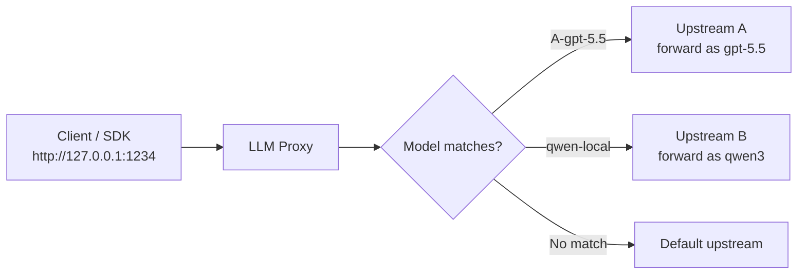
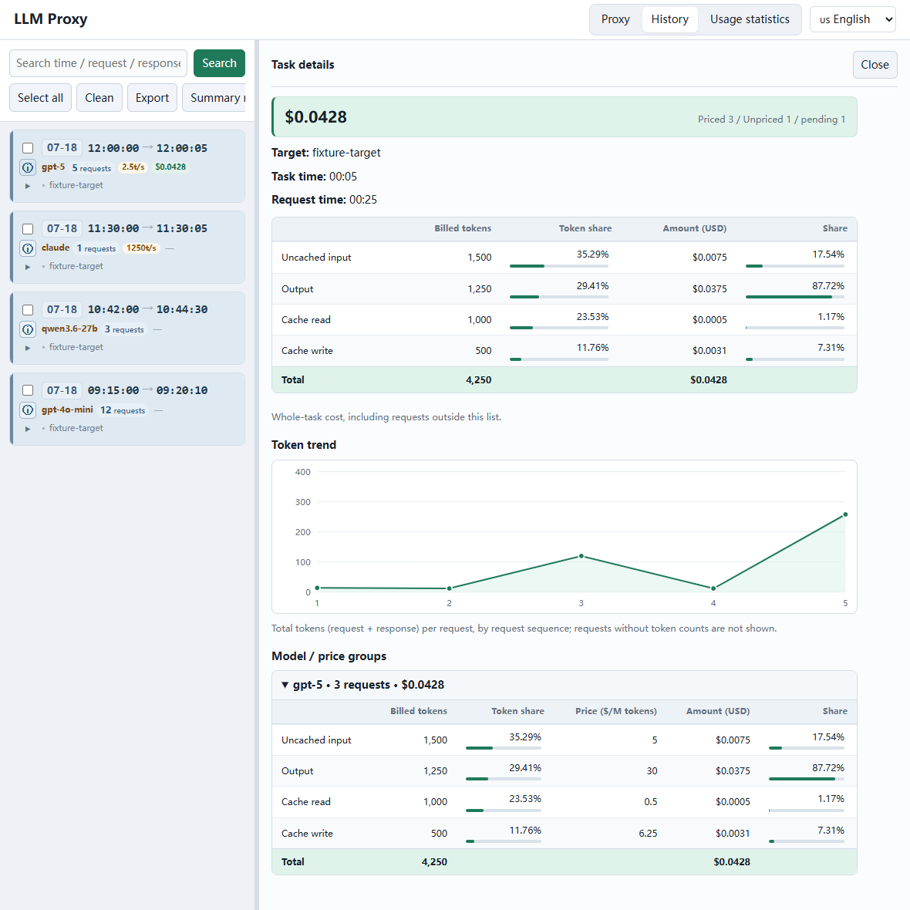
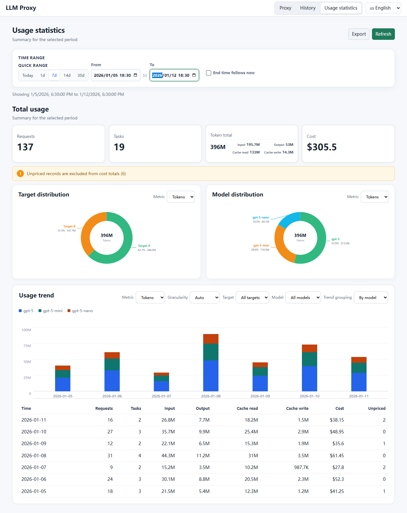

# LLM Proxy

[中文](README.md) | English

LLM Proxy is a local LLM gateway and visual console. It exposes OpenAI-compatible and Claude Messages APIs through local addresses, so you can choose upstreams by model and inspect complete request history in a browser.

## How It Works

Clients connect only to the local proxy address. The proxy reads the top-level `model` field, checks routing rules in order, and forwards the request to the first matching upstream. It can rewrite the model name; unmatched requests use the default upstream.



## Model Routing


| Feature | What it does |
| --- | --- |
| Multiple proxy ports | Create multiple local listeners from one console, each connected to different upstreams. |
| Multiple upstreams | Configure several upstreams for one proxy and choose a default fallback. |
| Model-based routing | Select an upstream from the top-level `model` field; the first matching rule wins and matching is case-sensitive. |
| Upstream order | Drag the ⠿ handle at the top-left of an upstream card (or focus the handle and use the arrow keys) to reorder upstreams; the order is the model-mapping priority, so earlier upstreams match first. |
| Model rewriting | Use `local-model => upstream-model` to rename the model sent upstream. |
| Wildcard matching | Use patterns such as `*gpt-5.5* => gpt-5.5` to match any prefix or suffix. |
| Upstream connectivity test | **Test** sends a minimal ping directly to OpenAI Chat, Responses, or Anthropic Messages. It does not pass through the proxy or enter History. |
| Request field transforms | Remove or inject top-level JSON fields in **More settings** to adapt requests for different upstreams. |
| Authentication and headers | Set an API key and custom headers separately for each upstream. |
| Log privacy | **Redact logs** masks common API keys, tokens, and passwords when saving logs; forwarded requests are unchanged. |
| Model pricing | Set per-million-token prices and a multiplier for input, output, and cache read/write. Prices are frozen when a request is forwarded; later edits affect new requests only. |

Example mappings:

```text
A-gpt-5.5 => gpt-5.5
qwen-local => qwen3
```

## History


| Feature | What it does |
| --- | --- |
| Automatic capture | Stores request and response headers and bodies, status, duration, target, routing details, and streaming summaries. |
| Task grouping | Groups consecutive Agent requests into tasks for reviewing one workflow. Each task header stacks time range, model and metrics, and target URL: the date badge and target stay neutral, while request count, decode speed, and cost use tinted value chips. |
| Full-text search | Search by path, method, status, target URL, task ID, or record ID; space-separated terms all apply. |
| Request details | View request and response JSON side by side with expand, collapse, wrapping, formatting, and copy controls. |
| Cost tracking | Shows task totals, priced/unpriced requests, pricing rules, and token details; each request shows its share. Missing reliable usage or pricing is marked unpriced, never free. Click the ⓘ icon button in a task header's control column to open the Task details panel with costs. |
| Intelligent summaries | Use a configured summary model to summarize individual requests and split consecutive messages into reusable cached phases; summarized requests show a gold star. |
| Export and cleanup | Export selected tasks as ZIP files or delete tasks and their request records. |
| Paging and refresh | Browse large log directories with paged loading and automatic refresh. |



The **Task details** panel (open it from the ⓘ button in a task header's control column) summarizes a single task's total cost, per-bucket token breakdown (input / output / cache read / cache write), and a **Token trend** line chart, with model/price groups expanded to show pricing and cost share.

History data is stored by default in a `traffic.db` SQLite database under each log directory; proxy settings are stored in `logs/proxies.json`. Exported ZIP files contain readable Markdown, `request.json`, and `response.json`.

## Usage statistics



The Usage statistics tab reads the same local history data as History and summarizes token and cost usage over a chosen time range.

| Feature | What it does |
| --- | --- |
| Time range and filters | Pick a start and end time (or 7/14/30-day and today shortcuts), optionally follow the current time, and filter by forwarding target and model. |
| Overview | Request count, task count, token totals (input / output / cache read / cache write), and total cost. |
| Trends and breakdowns | Trend charts over time (auto / daily / weekly / monthly granularity, by total, model, or target) plus per-target and per-model distributions with donut charts. |
| Task counting | A task counts toward the Task totals only when it has more than five priced requests within the displayed scope (overview total, distribution rows, and trend buckets alike). |
| Unpriced requests | Requests with missing usage or a missing price are flagged as unpriced, never free, and can be reviewed in detail. |
| CSV export | Export the current filter scope as CSV. |

Token amounts use compact units (K/M/B in the English interface; ten-thousand/hundred-million units in the Chinese interface).

The read-only endpoints are `/api/usage-statistics/overview`, `/api/usage-statistics/trend`, `/api/usage-statistics/options`, and `/api/usage-statistics/export`. They accept ISO-8601 `from`/`to` values; trend and export also accept `targetId`, `model`, and `granularity` (`day`, `week`, or `month`).

## Get Started in 5 Minutes

Node.js 24 is required:

```powershell
npm ci
npm run build
npm start
```

The console opens at <http://127.0.0.1:18080>. Use `npm start -- --no-browser` to skip automatic browser launch. Windows users can download an installer or portable version from GitHub Releases; the app runs in the system tray.

In **Proxy**, create a proxy, set a listen address such as `127.0.0.1:1234`, add an upstream such as `http://127.0.0.1:1235` or `https://openrouter.ai/api/v1`, enter an API key if required, and enable it. Point your client base URL to `http://127.0.0.1:1234`.

See [examples/responses_client.mjs](examples/responses_client.mjs) for a minimal Node.js example.

## Common Workflows

### Connect a local model

Start a local service such as llama.cpp at `http://127.0.0.1:1235`, create a proxy from `127.0.0.1:1234` to that address, and point your client at the local proxy.

### Serve multiple models from one port

Add multiple upstreams with mappings such as `A-gpt-5.5 => gpt-5.5` and `B-qwen => qwen3`. The client keeps one base URL while the proxy handles routing.

### Normalize request parameters

Enter fields such as `temperature, top_p, top_k` under **Request fields to remove**, or inject JSON such as `{"stream":true}`. The transformed request is recorded in History.

## Configuration and Security

Proxy settings are saved in `logs/proxies.json`; console settings are saved in `llm-proxy.json`. You usually do not need to edit these files manually.

Keep the console and proxy listeners bound to `127.0.0.1` where possible. Logs may contain prompts, documents, API keys, and tool output; do not commit configuration files or log directories. Stop the proxy and back up the entire log directory before migration or upgrades, including `traffic.db-wal` and `traffic.db-shm`. See [docs/migration-rollback.md](docs/migration-rollback.md) for details.
