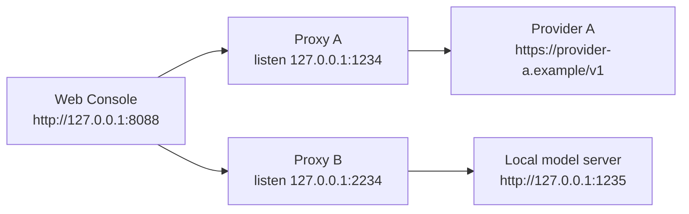
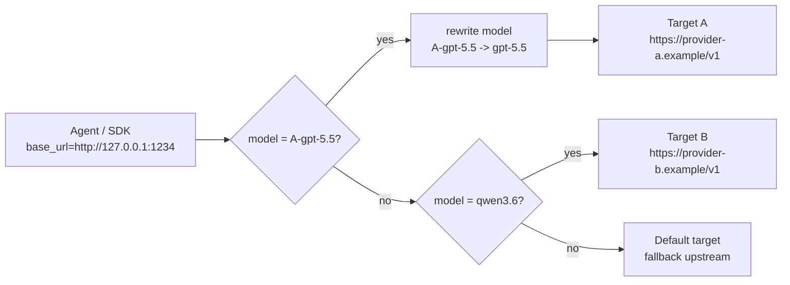
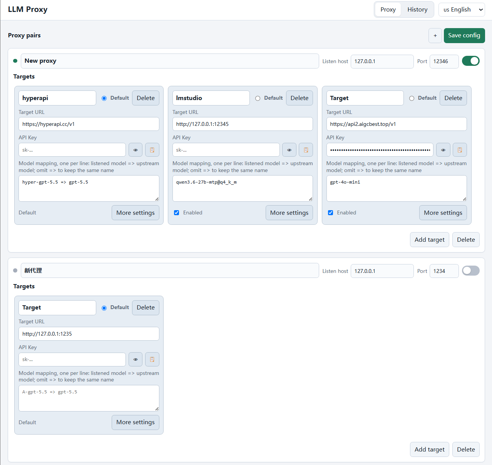
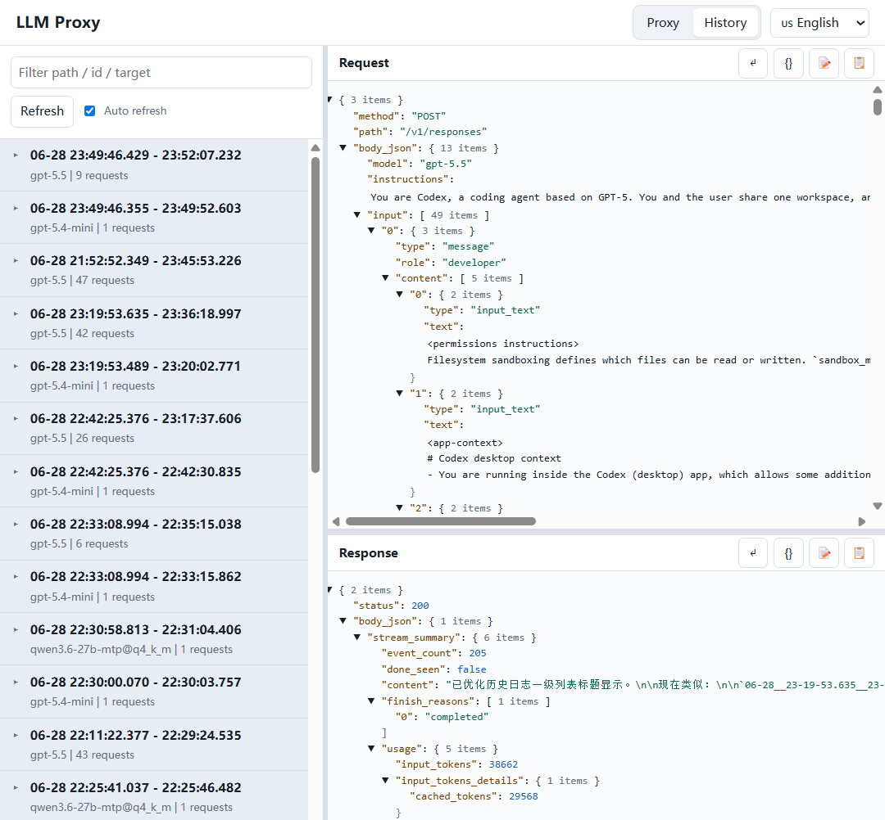

# LLM Proxy

English | [中文](README.cn.md)

LLM Proxy is a local web console for managing OpenAI-compatible LLM proxy traffic. It lets you create one or more local proxy endpoints, route each endpoint to one or more upstream APIs by request model, and inspect the full request/response history from a browser.

The command line is now mainly the launcher and compatibility layer. Day-to-day use is centered on the built-in UI: enable proxy pairs, edit upstream settings, search logs, and review complete interaction payloads without digging through terminal output.

## How Routing Works

One UI can manage multiple local proxy listeners. Each listener can either behave like a simple one-to-one proxy or route different request models to different upstreams.



Inside one proxy listener, routing is based on the top-level JSON `model` field. Matching targets may rewrite the model name before forwarding; unmatched requests go to the configured default target.



Each upstream target keeps its own timeout, readable log directory, upstream headers, and request-field rewrite rules. Non-default targets can be disabled temporarily; disabled targets are skipped during model matching.

## What It Does

- Manage multiple local proxy pairs from one web interface.
- Give each local proxy pair one listen address and one or more upstream targets.
- Route requests to different upstream targets by matching the top-level JSON `model` field.
- Rewrite model names per upstream, for example receive `A-gpt-5.5` locally and forward it as `gpt-5.5`.
- Configure a default upstream target for unmatched models.
- Enable or disable non-default upstream targets without deleting their settings.
- Forward OpenAI-compatible requests to local or remote upstreams such as `llama.cpp`, OpenRouter, or another compatible gateway.
- Record complete request and response data, including headers, bodies, status codes, durations, client addresses, target addresses, and streaming summaries.
- Browse logs in the UI with search across path, method, status, target, record id, and task grouping.
- Group related multi-turn Agent requests into task folders for easier review.
- Inspect request and response JSON side by side, with wrapping, expansion, formatting, and copy controls.
- Optionally remove or inject top-level JSON request fields before forwarding.
- Persist proxy configuration in `logs/proxies.json` by default.

## Quick Start

Start the web console:

```powershell
python -m llm_proxy --ui
```

Or on Windows, run:

```powershell
.\run.bat
```

The browser opens automatically at:

```text
http://127.0.0.1:8088
```

In the UI:

1. Open the **Proxy** tab.
2. Add or edit a proxy pair.
3. Set the local listen address, for example `127.0.0.1:1234`.
4. Add one or more upstream targets, for example `http://127.0.0.1:1235` or `https://openrouter.ai/api/v1`.
5. For each upstream target, optionally add model mappings such as `A-gpt-5.5 => gpt-5.5`.
6. Choose the default target used when no model mapping matches.
7. Enable the proxy pair.
8. Point your Agent or SDK base URL to the local proxy address.

For the default proxy pair, client requests should go to:

```text
http://127.0.0.1:1234
```

## Web Console

The UI is served at `http://127.0.0.1:8088` by default. Use `--ui-host` and `--ui-port` if you need a different admin address.

### Proxy Management

The **Proxy** tab is the main control surface. Each proxy pair includes:

- Name and enabled/running status.
- Listen host and port.
- One or more upstream targets, shown horizontally inside the proxy pair.
- A default target for unmatched request models.

Each upstream target includes:

- Enabled state. The default target is always available as fallback; non-default targets can be disabled.
- Upstream target URL.
- API Key. If set, it adds or replaces `Authorization: Bearer ...` on forwarded requests.
- Model mappings, one per line. Use `local-model => upstream-model`; omit `=> upstream-model` to keep the same model name.
- Timeout.
- Log directory, default `logs`.
- Upstream headers, one `Name: value` entry per line.
- Request fields to strip before forwarding.
- Request fields to inject before forwarding as a JSON object.

The target URL, API Key, and model mappings are shown by default. Use **More settings** on a target card to reveal timeout, readable log directory, headers, and request-field rewriting options.

Proxy pairs are saved to `logs/proxies.json` unless `--config-file` is provided.



### Model Routing

When the proxy receives a request, it reads the top-level JSON `model` field and checks the enabled upstream targets in order. If a target has a matching model mapping, the request is forwarded to that target. If the mapping specifies a different upstream model name, the proxy rewrites `model` before forwarding.

If no enabled non-default target matches, the request goes to the configured default target. The default target also handles requests without a readable JSON `model` field.

Example target mappings:

```text
A-gpt-5.5 => gpt-5.5
qwen-local => qwen3
fallback-model
```

In the last line, `fallback-model` is forwarded with the same model name.

### History And Logs

The **History** tab lets you review captured traffic without opening log files manually. It supports:

- Automatic refresh.
- Search by method, path, status, target URL, task id, and record id.
- Task grouping for related Agent workflows.
- Side-by-side request and response detail panes.
- JSON expansion/collapse, line wrapping, string formatting, and copy actions.



## Typical Workflows

### Inspect A Local Model Server

1. Start your local upstream server, for example `llama.cpp`, on `http://127.0.0.1:1235`.
2. Start LLM Proxy with `python -m llm_proxy --ui`.
3. In the UI, enable a proxy pair from `127.0.0.1:1234` to `http://127.0.0.1:1235`.
4. Configure your client base URL as `http://127.0.0.1:1234`.
5. Open **History** to inspect the captured interaction.

### Route Multiple Models From One Local Endpoint

1. Create one proxy pair listening on `127.0.0.1:1234`.
2. Add target A, for example `https://provider-a.example/v1`, and map `A-gpt-5.5 => gpt-5.5`.
3. Add target B, for example `https://provider-b.example/v1`, and map `B-qwen => qwen3`.
4. Set one target as the default fallback.
5. Point your client at `http://127.0.0.1:1234`; requests are routed by their `model` field.

### Inspect A Remote Gateway

1. Create a proxy pair with target URL `https://openrouter.ai/api/v1` or another OpenAI-compatible endpoint.
2. Add the upstream key in the target card's **API Key** field, for example `sk-or-...`.
3. Enable the proxy pair.
4. Point your local client at the proxy listen address.

### Normalize Request Parameters

Some upstreams reject or ignore sampling fields from another client. In a target's **More settings** section, use **Request fields to remove before forwarding** to strip top-level JSON fields such as:

```text
temperature, top_p, top_k, min_p, typical_p, repeat_penalty,
presence_penalty, frequency_penalty, seed
```

Use **Request fields to inject before forwarding** to add or override top-level JSON fields with a JSON object, for example:

```json
{"metadata":{"source":"llm-proxy"},"stream":true}
```

When a request is changed, the logs record `request.stripped_fields`, `request.injected_fields`, and `request.upstream_body`.

## Logs On Disk

Default paths:

- Proxy configuration: `logs/proxies.json`
- Readable interaction logs: `logs/readable/` by default, configurable per upstream target by setting the log root.
- Task-grouped logs: `logs/tasks/`

Each captured interaction is written to its own directory with:

- A Markdown summary.
- `request.json`.
- `response.json`.

For OpenAI-compatible SSE responses, `response.json` includes an aggregated `stream_summary` while preserving the original stream data. The summary can include `content`, `reasoning`, `tool_calls`, `finish_reasons`, and `usage`.

## Command-Line Compatibility

The direct single-proxy mode is still available for scripts and existing workflows:

```powershell
python -m llm_proxy
```

Legacy entry point:

```powershell
python proxy.py
```

Remote target example:

```powershell
python -m llm_proxy --target-url https://openrouter.ai/api/v1
```

Header injection example:

```powershell
python -m llm_proxy `
  --target-url https://openrouter.ai/api/v1 `
  --target-api-key "sk-or-..." `
  --target-header "HTTP-Referer: http://localhost" `
  --target-header "X-Title: LLM Proxy"
```

CLI request rewriting is also available:

```powershell
python -m llm_proxy --strip-request-fields "temperature,top_p"
python -m llm_proxy --inject-request-fields '{"metadata":{"source":"proxy"},"stream":true}'
```

## Configuration Reference

Common launcher options and environment variables:

- `--ui` / `LLM_PROXY_UI=1`
- `--ui-host` / `LLM_PROXY_UI_HOST`, default `127.0.0.1`
- `--ui-port` / `LLM_PROXY_UI_PORT`, default `8088`
- `--config-file` / `LLM_PROXY_CONFIG_FILE`, default `logs/proxies.json`
- `--readable-log-dir` / `LLM_PROXY_READABLE_LOG_DIR`, default `logs`
- `--listen-host` / `LLM_PROXY_HOST`
- `--listen-port` / `LLM_PROXY_PORT`
- `--target-url` / `LLM_PROXY_TARGET_URL`
- `--target-scheme` / `LLM_PROXY_TARGET_SCHEME`
- `--target-host` / `LLM_PROXY_TARGET_HOST`
- `--target-port` / `LLM_PROXY_TARGET_PORT`
- `--target-api-key` / `LLM_PROXY_TARGET_API_KEY`
- `--target-header`
- `--timeout` / `LLM_PROXY_TIMEOUT`
- `--strip-request-fields` / `LLM_PROXY_STRIP_REQUEST_FIELDS`
- `--inject-request-fields` / `LLM_PROXY_INJECT_REQUEST_FIELDS`
- `--access-log` / `LLM_PROXY_ACCESS_LOG=1`

`--target-url` takes precedence over `--target-scheme`, `--target-host`, and `--target-port` in single-proxy CLI mode.

## Project Structure

```text
llm_proxy/
  __main__.py       # python -m llm_proxy entry point
  cli.py            # launcher, UI startup, and compatibility CLI mode
  ui.py             # built-in web console and admin API
  manager.py        # multi-proxy management and config persistence
  server.py         # HTTP proxy server and handler
  logger.py         # readable Markdown/JSON log writer
  records.py        # request/response analysis and task fingerprints
  streams.py        # SSE stream summaries
  sanitize.py       # request field stripping/injection
  target.py         # upstream URL parsing and path joining
  payloads.py       # body encoding, parsing, and rendering helpers
tests/
  test_proxy.py
doc/
  ui_proxy_en.png
  ui_logs_en.png
proxy.py            # legacy entry script
run.bat             # Windows UI launcher
pyproject.toml
```

## Tests

```powershell
python -m unittest discover -s tests
```
