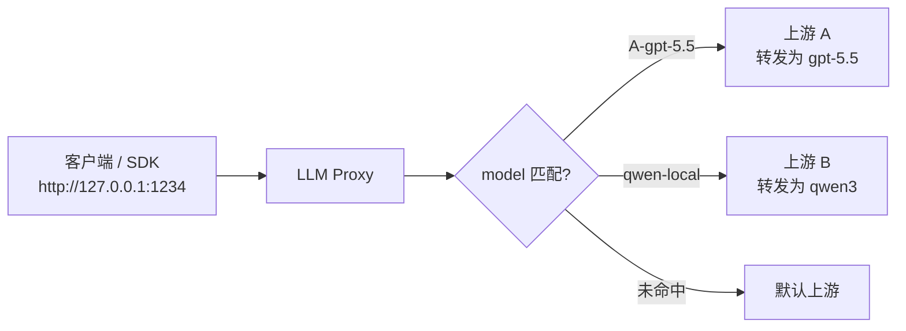
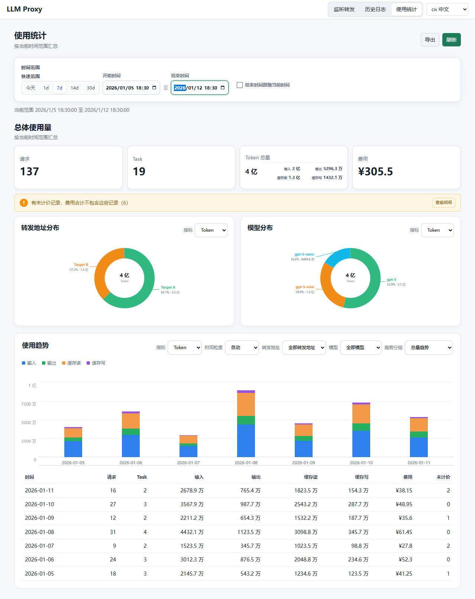

# LLM Proxy

[English](README.en.md) | 中文

LLM Proxy 是一个运行在本机的 LLM 网关和可视化控制台。它把 OpenAI 兼容接口或 Claude Messages 接口统一暴露为本地地址，让你可以按模型选择上游，并在浏览器中查看完整请求记录。

## 工作方式

客户端只需要连接本地代理地址。代理读取请求中的 `model`，依次检查模型路由规则；命中后转发到对应上游并可改写模型名，没有命中则使用默认上游。


```mermaid
flowchart LR
  C[客户端 / SDK\nhttp://127.0.0.1:1234] --> P[LLM Proxy]
  P --> M{model 匹配?}
  M -->|A-gpt-5.5| A[上游 A\n转发为 gpt-5.5]
  M -->|qwen-local| B[上游 B\n转发为 qwen3]
  M -->|未命中| D[默认上游]
```

## 模型路由


| 功能 | 说明 |
| --- | --- |
| 多个代理端口 | 在一个控制台中创建多个本地监听地址，每个地址可连接不同上游。 |
| 多个上游 | 一个代理可以配置多个上游，并指定一个默认上游处理未匹配请求。 |
| 按模型分流 | 根据请求顶层 `model` 字段选择上游，第一条匹配规则优先，匹配区分大小写。 |
| 上游排序 | 拖动上游卡片左上角的 ⠿ 手柄（键盘聚焦手柄后按方向键同样可移动）调整上游顺序，顺序就是模型映射的匹配优先级，靠前的上游先匹配。 |
| 模型改写 | 用 `本地模型 => 上游模型` 将客户端模型名改成上游需要的名称。 |
| 通配符匹配 | 支持 `*gpt-5.5* => gpt-5.5`，匹配任意前后缀。 |
| 上游连通性测试 | **Test** 按钮直接发送最小 ping 请求，支持 OpenAI Chat、Responses 和 Anthropic Messages。测试不会经过代理，也不会写入历史。 |
| 请求字段处理 | 在 **More settings** 中删除或注入顶层 JSON 字段，适配不同上游的参数要求。 |
| 鉴权与请求头 | 为每个上游单独设置 API Key 和自定义 headers。 |
| 日志隐私 | 开启 **Redact logs** 后，仅在保存日志时隐藏常见 API key、token 和密码字段。 |
| 模型价格 | 为模型设置输入、输出、缓存读写的每百万 token 价格和倍率；价格在请求转发时冻结，后续修改只影响新请求。 |

示例映射：

```text
A-gpt-5.5 => gpt-5.5
qwen-local => qwen3
```

## 历史记录


| 功能 | 说明 |
| --- | --- |
| 自动记录 | 保存请求和响应 headers、body、状态码、耗时、目标地址、路由信息及流式响应摘要。 |
| 任务分组 | 将 Agent 的连续多轮请求归入任务，便于按一次工作流查看。任务卡片头部按“时间范围 / 模型与指标 / 转发地址”三行排列：日期徽标与转发地址为中性蓝灰，请求数、解码速度、费用以浅色底标签区分。 |
| 全文搜索 | 按路径、方法、状态、目标 URL、任务 ID 或记录 ID 搜索；空格分隔的关键词同时生效。 |
| 请求详情 | 并排查看请求和响应 JSON，支持展开、折叠、换行、格式化和复制。 |
| 成本统计 | 按任务显示总费用、已计价/未计价请求、价格规则和 token 明细；每条请求显示其费用占比。缺少可靠用量或价格时标记为未计价，不会当作免费。点击任务头部控制列的 ⓘ 图标按钮打开“任务明细”面板查看费用，面板顶部显示任务总耗时（第一个请求到最后一个请求结束的墙钟时间）与请求总耗时（各请求耗时之和，不含请求间隔），面板内另附“Token 趋势”折线图，按请求序号展示每个请求的 token 总量（请求 + 响应）。 |
| 智能总结 | 使用配置的总结模型总结单条请求，并将连续消息分成可复用的缓存阶段；已有总结的请求会显示金色星标。 |
| 导出与清理 | 将选中的任务导出为 ZIP，或删除任务及其请求记录。 |
| 分页与刷新 | 大型日志目录支持分页加载和自动刷新。 |

历史数据默认保存在每个日志目录的 `traffic.db` SQLite 数据库中，代理配置保存在 `logs/proxies.json`。导出的 ZIP 包含可读 Markdown、`request.json` 和 `response.json`。

## 使用统计



“使用统计”标签读取与历史相同的本地数据，按时间范围汇总 token 与费用使用情况。

| 功能 | 说明 |
| --- | --- |
| 时间范围与筛选 | 选择起止时间（或 7/14/30 天、今天快捷区间），可选“跟随当前时间”自动刷新，并按转发地址、模型筛选。 |
| 概览 | 请求数、任务数、Token 总量（输入/输出/缓存读取/缓存写入）与费用。 |
| 趋势与分布 | 时间趋势图（自动/日/周/月粒度，按总量、模型或地址）以及按转发地址、按模型的占比环形图；分类超过六项时，分布和按模型/地址堆叠趋势会将当前指标下合计占比不足 10% 的末尾分类合并为“其他”，减少杂乱。 |
| 任务计数 | 只有当任务在显示范围内有超过 5 条已计价请求时，才计入任务总数（概览、分布行与趋势桶规则一致）。 |
| 未计价请求 | 缺少用量或价格的请求标记为“未计价”，不会当作免费，并可查看明细。 |
| CSV 导出 | 将当前筛选范围导出为 CSV。 |

Token 以压缩单位显示（英文界面使用 K/M/B，中文界面使用万/亿）。

只读接口包括 `/api/usage-statistics/overview`、`/api/usage-statistics/trend`、`/api/usage-statistics/options` 和 CSV 导出接口 `/api/usage-statistics/export`。它们使用 ISO-8601 格式的 `from`/`to` 参数；趋势和导出还支持 `targetId`、`model` 与 `granularity`（`day`、`week`、`month`）参数。

## 5 分钟开始使用

需要 Node.js 24：

```powershell
npm ci
npm run build
npm start
```

控制台默认打开 <http://127.0.0.1:18080>。不想自动打开浏览器时使用 `npm start -- --no-browser`。Windows 用户也可以从 GitHub Release 下载安装包或 portable 版本；启动后应用会驻留在系统托盘中。

在 **Proxy** 页面新建代理，设置监听地址（例如 `127.0.0.1:1234`），添加上游地址（例如 `http://127.0.0.1:1235` 或 `https://openrouter.ai/api/v1`），填写 API Key（如需要）并启用。然后把客户端的 API base URL 改为 `http://127.0.0.1:1234`。

最小 Node.js 示例见 [examples/responses_client.mjs](examples/responses_client.mjs)。

## 常见用法

### 连接本地模型

启动本地服务（例如 llama.cpp）并监听 `http://127.0.0.1:1235`，然后创建从 `127.0.0.1:1234` 到该地址的代理，把客户端连接到本地代理即可。

### 一个端口连接多个模型

添加多个上游并配置模型映射，例如 `A-gpt-5.5 => gpt-5.5` 和 `B-qwen => qwen3`。客户端始终使用同一个本地 base URL，代理负责分流。

### 统一请求参数

在 **Request fields to remove** 中填写 `temperature, top_p, top_k` 等字段；在 **Request fields to inject** 中填写 JSON，例如 `{"stream":true}`。改写结果会记录在历史详情中。

## 配置与安全

代理设置会保存到 `logs/proxies.json`，管理页面设置保存在 `llm-proxy.json`。通常无需手动编辑这些文件。

请尽量让管理页面和代理监听地址保持在 `127.0.0.1`。日志可能包含提示词、文档、API key 和工具输出；不要把配置文件或日志目录提交到代码仓库。迁移或升级前请停止代理并备份整个日志目录，包括 `traffic.db-wal` 和 `traffic.db-shm`。详细步骤见 [docs/migration-rollback.md](docs/migration-rollback.md)。
