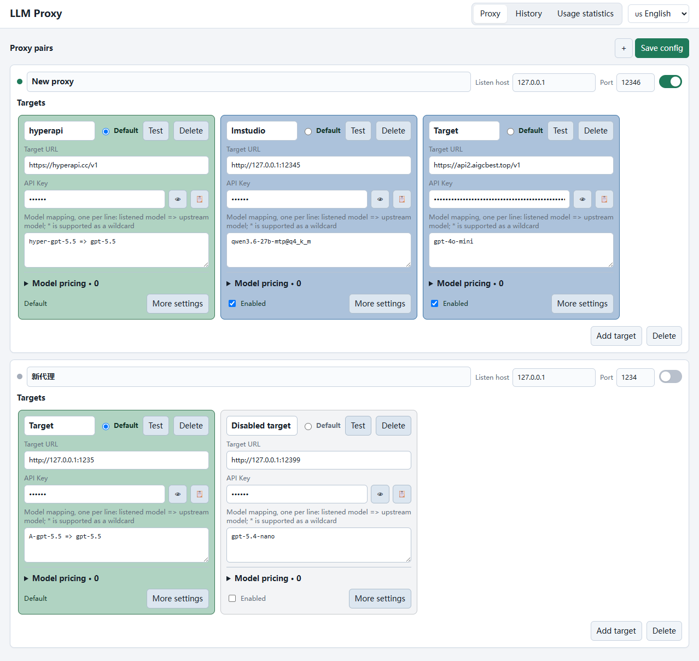
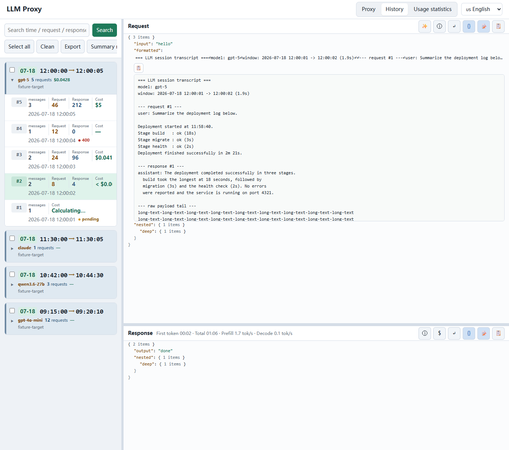
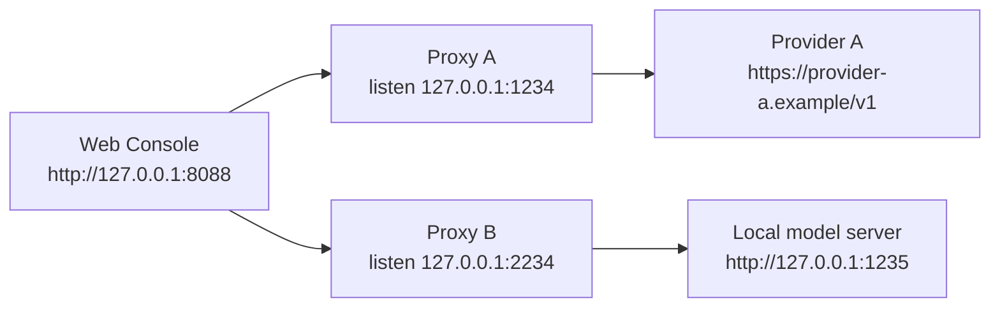
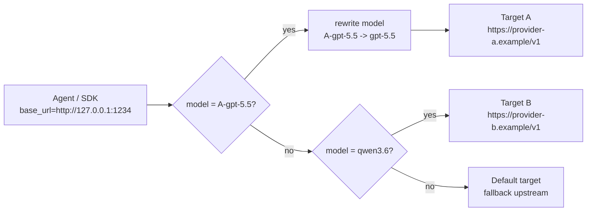

# LLM Proxy

English | [中文](README.cn.md)

LLM Proxy is a local web console for managing OpenAI-compatible and Claude Messages-style LLM proxy traffic. Create one or more local proxy endpoints, route each endpoint to one or more upstream APIs by request model, and inspect complete request/response history from the browser.

The command line is mainly the launcher. Day-to-day use happens in the built-in UI: enable proxy pairs, edit upstream settings, search logs, export captured traffic, and review complete interaction payloads without digging through terminal output.





## How Routing Works

One UI can manage multiple local proxy listeners. Each listener can either behave like a simple one-to-one proxy or route different request models to different upstreams.


```mermaid
flowchart LR
  UI["Web Console<br/>http://127.0.0.1:8088"] --> P1["Proxy A<br/>listen 127.0.0.1:1234"]
  UI --> P2["Proxy B<br/>listen 127.0.0.1:2234"]
  P1 --> A1["Provider A<br/>https://provider-a.example/v1"]
  P2 --> B1["Local model server<br/>http://127.0.0.1:1235"]
```

Inside one proxy listener, routing is based on the top-level JSON `model` field. Matching targets may rewrite the model name before forwarding; unmatched requests go to the configured default target.


```mermaid
flowchart LR
  Client["Agent / SDK<br/>base_url=http://127.0.0.1:1234"] --> MatchA{"model = A-gpt-5.5?"}
  MatchA -- yes --> RewriteA["rewrite model<br/>A-gpt-5.5 -> gpt-5.5"]
  RewriteA --> UpstreamA["Target A<br/>https://provider-a.example/v1"]
  MatchA -- no --> MatchB{"model = qwen3.6?"}
  MatchB -- yes --> UpstreamB["Target B<br/>https://provider-b.example/v1"]
  MatchB -- no --> Default["Default target<br/>fallback upstream"]
```

Each upstream target keeps its own timeout, log directory, upstream headers, and request-field rewrite rules. Non-default targets can be disabled temporarily; disabled targets are skipped during model matching.

## What It Does

- Manage multiple local proxy pairs from one web interface.
- Give each local proxy pair one listen address and one or more upstream targets.
- Route requests to different upstream targets by matching the top-level JSON `model` field.
- Rewrite model names per upstream, for example receive `A-gpt-5.5` locally and forward it as `gpt-5.5`.
- Configure a default upstream target for unmatched models.
- Enable or disable non-default upstream targets without deleting their settings.
- Forward OpenAI-compatible requests and Anthropic/Claude-style `/v1/messages` requests to local or remote upstreams such as `llama.cpp`, OpenRouter, or another compatible gateway.
- Record complete request and response data, including headers, bodies, status codes, durations, client addresses, target addresses, and streaming summaries.
- Browse logs in the UI with search across path, method, status, target, record id, and task grouping.
- Group related multi-turn Agent requests into task folders for easier review, including Claude Messages conversations.
- Inspect request and response JSON side by side, with wrapping, expansion, formatting, and copy controls.
- Optionally remove or inject top-level JSON request fields before forwarding.
- Optionally redact sensitive headers and common JSON secret fields in stored logs.
- Export task logs as a ZIP archive and clean selected task groups.
- Persist proxy configuration in `logs/proxies.json` by default.

## Quick Start

Start the web console:

```powershell
npm ci
npm run build
npm start
```

Node.js 24 is required. The browser opens automatically at `http://127.0.0.1:8088`; use
`npm start -- --no-browser` for a headless launch.

### Windows Tray application

Download either the installer or portable executable from a GitHub Release. To build both locally on
Windows:

```powershell
npm ci
npm run package:electron
```

After launch, LLM Proxy appears as a system tray icon. Left-click the icon to open the admin UI, or right-click for **Open Admin UI** and **Exit**. To open the browser immediately on startup, run:

```powershell
.\release\LLM Proxy-0.1.0-x64-portable.exe --open-on-start
```

The project also includes GitHub Actions automation for packaging and releases:

- Regular pushes and pull requests build the Windows installer, portable executable, CLI ZIP, and
  `SHA256SUMS.txt` as workflow artifacts.
- Pushing a `v*` tag creates or updates a GitHub Release with those artifacts.

Publish a release:

```powershell
git tag v0.1.0
git push origin v0.1.0
```

In the UI:

1. Open the **Proxy** tab.
2. Add or edit a proxy pair.
3. Set the local listen address, for example `127.0.0.1:1234`.
4. Add one or more upstream targets, for example `http://127.0.0.1:1235` or `https://openrouter.ai/api/v1`.
5. For each upstream target, optionally add model mappings such as `A-gpt-5.5 => gpt-5.5`.
6. Choose the default target used when no model mapping matches.
7. Enable the proxy pair.
8. Point your Agent or SDK base URL to the local proxy address.

For the default proxy pair, client requests should go to:

```text
http://127.0.0.1:1234
```

See [the Node.js OpenAI SDK Responses example](examples/responses_client.mjs) for a minimal client.

## Web Console

The UI is served at `http://127.0.0.1:8088` by default. Use `--host` and `--port` if you need a different admin address.

### Proxy Management

The **Proxy** tab is the main control surface. Each proxy pair includes:

- Name and enabled/running status.
- Listen host and port.
- One or more upstream targets, shown horizontally inside the proxy pair.
- A default target for unmatched request models.

Each upstream target includes:

- Enabled state. The default target is always available as fallback; non-default targets can be disabled.
- Upstream target URL.
- API Key. If set, it adds or replaces `Authorization: Bearer ...` on forwarded requests.
- Model mappings, one per line. Use `local-model => upstream-model`; omit `=> upstream-model` to keep the same model name.
- Timeout.
- Log directory, default `logs`.
- Upstream headers, one `Name: value` entry per line.
- Request fields to strip before forwarding.
- Request fields to inject before forwarding as a JSON object.
- stored log redaction.

The target URL, API Key, and model mappings are shown by default. Use **More settings** on a target card to reveal timeout, log directory, headers, and request-field rewriting options.

Proxy pairs are saved to `logs/proxies.json` unless `--config-file` is provided.

### Model Routing

When the proxy receives a request, it reads the top-level JSON `model` field and checks the enabled upstream targets in order. If a target has a matching model mapping, the request is forwarded to that target. If the mapping specifies a different upstream model name, the proxy rewrites `model` before forwarding.

If no enabled non-default target matches, the request goes to the configured default target. The default target also handles requests without a parseable JSON `model` field.

Example target mappings:

```text
A-gpt-5.5 => gpt-5.5
qwen-local => qwen3
fallback-model
```

In the last line, `fallback-model` is forwarded with the same model name.

### Supported Request Shapes

The proxy forwards arbitrary HTTP paths, but it understands the common LLM request shapes below for log summaries, stream summaries, and task grouping:

- OpenAI Responses API: `/v1/responses`
- OpenAI Chat Completions API: `/v1/chat/completions`
- OpenAI Completions API: `/v1/completions`
- Anthropic/Claude Messages API: `/v1/messages`

For Claude Messages requests, the logger extracts the top-level `system` field and the `messages` array. Task grouping uses the stable first non-context user message as the task boundary and then requires later Claude requests to preserve the previous user-message sequence. If a client drops the first user message from a later request, that request is treated as a new task instead of being merged by loose overlap.

### History And Logs

The **History** tab lets you review captured traffic without opening log files manually. It supports:

- Automatic refresh.
- Search by method, path, status, target URL, task id, and record id.
- Paged loading for large log directories.
- Task grouping for related Agent workflows.
- Side-by-side request and response detail panes.
- JSON expansion/collapse, line wrapping, string formatting, and copy actions.
- ZIP export and selected-task cleanup.

Traffic history is stored in `traffic.db` under each configured log root. The database stores task metadata, request/response details, response-id links, context links, and searchable fields in SQLite, so the History tab does not need to scan Markdown or JSON files for normal browsing.

## Typical Workflows

### Inspect A Local Model Server

1. Start your local upstream server, for example `llama.cpp`, on `http://127.0.0.1:1235`.
2. Start LLM Proxy with `npm start` after `npm run build`.
3. In the UI, enable a proxy pair from `127.0.0.1:1234` to `http://127.0.0.1:1235`.
4. Configure your client base URL as `http://127.0.0.1:1234`.
5. Open **History** to inspect the captured interaction.

### Route Multiple Models From One Local Endpoint

1. Create one proxy pair listening on `127.0.0.1:1234`.
2. Add target A, for example `https://provider-a.example/v1`, and map `A-gpt-5.5 => gpt-5.5`.
3. Add target B, for example `https://provider-b.example/v1`, and map `B-qwen => qwen3`.
4. Set one target as the default fallback.
5. Point your client at `http://127.0.0.1:1234`; requests are routed by their `model` field.

### Inspect A Remote Gateway

1. Create a proxy pair with target URL `https://openrouter.ai/api/v1` or another OpenAI-compatible endpoint.
2. Add the upstream key in the target card's **API Key** field, for example `sk-or-...`.
3. Enable the proxy pair.
4. Point your local client at the proxy listen address.

### Normalize Request Parameters

Some upstreams reject or ignore sampling fields from another client. In a target's **More settings** section, use **Request fields to remove before forwarding** to strip top-level JSON fields such as:

```text
temperature, top_p, top_k, min_p, typical_p, repeat_penalty,
presence_penalty, frequency_penalty, seed
```

Use **Request fields to inject before forwarding** to add or override top-level JSON fields with a JSON object, for example:

```json
{"metadata":{"source":"llm-proxy"},"stream":true}
```

When a request is changed, the logs record `request.stripped_fields`, `request.injected_fields`, and `request.upstream_body`.

### Redact Stored Logs

Enable **Redact logs** in a target's **More settings** section to mask common sensitive values in stored logs. Redaction covers headers such as `Authorization` and `X-API-Key`, plus JSON fields such as `api_key`, `access_token`, `token`, `password`, and `secret`.

Redaction affects stored logs only. Requests are still forwarded to the upstream with their original values.

## Logs On Disk

Default paths:

- Proxy configuration: `logs/proxies.json`
- Traffic log database: `logs/traffic.db` by default, configurable per upstream target by setting the log root.

Each captured interaction is stored as a SQLite record with:

- Task grouping metadata.
- Request and response headers.
- Parsed request and response bodies.
- Status, duration, message count, token count, target URL, and routing metadata.

For OpenAI-compatible and Claude Messages SSE responses, the stored response body includes an aggregated `stream_summary` while preserving the useful stream content. The summary can include `content`, `reasoning`, `tool_calls`, `response_tool_calls`, compact `web_search_calls`, `claude_tool_calls`, `finish_reasons`, `usage`, and compact response metadata.

SSE responses are forwarded to the client line by line as they arrive from the upstream. Non-SSE responses are still forwarded in regular binary chunks.

The History tab can export task logs as `llm-proxy-logs.zip`. The ZIP is generated from SQLite on demand and contains human-readable Markdown plus `request.json` and `response.json` files. Select one or more task groups in the log list, then use cleanup to delete those tasks and their request records from the database.

## Backup, Migration, and Rollback

Before the first Node/Electron launch, stop all existing writers and back up `proxies.json` plus the
entire log root. Keep `traffic.db`, `traffic.db-wal`, and `traffic.db-shm` together when present. Plan
for free space of at least 2.4 times the current database size.

- [Migration rehearsal results](docs/migration-rehearsal-report.md)
- [Operator backup and rollback procedure](docs/migration-rollback.md)
- [Node and Electron troubleshooting](docs/troubleshooting.md)

After migration, run `npm run validate:migration -- <log-root>` from a built checkout and retain the
JSON count/sample report with the release record.

## Security Notes

LLM Proxy is designed for local development and traffic inspection. Keep the admin UI bound to `127.0.0.1` unless you have added your own network controls.

- Request and response logs may contain prompts, documents, API keys, tool outputs, and other sensitive data.
- Upstream API keys are stored in the proxy config file. Keep `logs/proxies.json` and custom config paths out of source control.
- The proxy can forward arbitrary request bodies to configured upstreams. Only expose local listen ports to clients you trust.
- Use request-field stripping for fields you know an upstream should not receive, but do not treat it as a complete data-loss-prevention system.
- Rotate, export, or delete log databases when they are no longer needed.

## Configuration Reference

Common launcher options and environment variables:

- `--host` / `LLM_PROXY_UI_HOST`, default `127.0.0.1`
- `--port` / `LLM_PROXY_UI_PORT`, default `8088`
- `--config-file` / `LLM_PROXY_CONFIG_FILE`, default `logs/proxies.json`
- `--log-root` / `LLM_PROXY_LOG_ROOT`, default `logs`
- `--no-browser` / `LLM_PROXY_NO_BROWSER=1`

Proxy listen addresses, upstream targets, API keys, headers, model mappings, timeouts, and request-field rewriting are configured in the web console and saved to `logs/proxies.json`.

## Project Structure

```text
src/
  main.ts           # Node CLI entry point
  app/              # application assembly and shutdown lifecycle
  cli/              # options, browser launch, signals, and output
  admin/            # Fastify admin API and static web console
  config/           # schema, normalization, defaults, and atomic repository
  proxy/            # listeners, routing, upstream forwarding, and SSE
  logging/          # task matching and durable traffic writes
  persistence/      # SQLite schema, migrations, backup, and repositories
  maintenance/      # history query, ZIP export, and cleanup
electron/           # headless tray application entry and controllers
test-node/          # Vitest unit, integration, browser E2E, and visual tests
scripts/            # build, smoke, migration, checksum, and benchmark tools
fixtures/parity/    # deterministic config and database fixtures
.github/workflows/
  ci.yml             # Node checks on Linux and Windows
  release.yml        # Electron artifacts and v-tag GitHub Releases
doc/
  ui_proxy_en.png
  ui_logs_en.png
electron-builder.yml
package.json
package-lock.json
```

## Tests

```powershell
npm ci
npm run check
```

Development checks:

```powershell
npm run format:check
npm run lint
npm run typecheck
npm test
npm run build
```

Development and packaging commands:

```powershell
npm run dev                 # watch and restart the Node CLI
npm run package:electron    # Windows installer and portable app
npm run package:cli         # compiled CLI ZIP
npm run smoke:artifact      # Windows packaged startup smoke test
npm run checksums           # release/SHA256SUMS.txt
```
