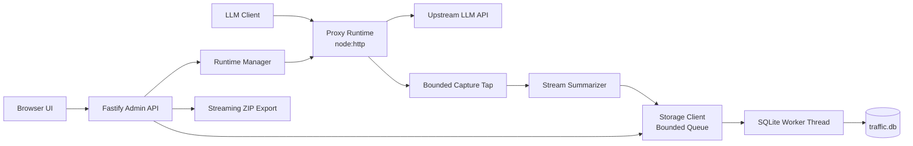
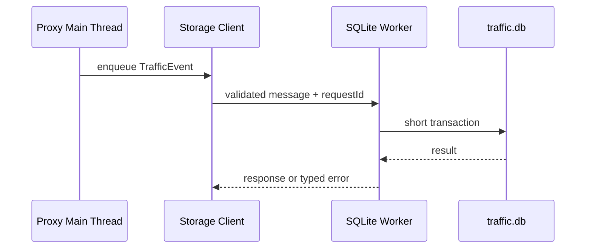

# Node.js 正式版重构设计

## 1. 文档目的

本文档定义 LLM Proxy 从 Python 原型重构为 Node.js/TypeScript 正式项目的目标架构、工程约束和验收标准。它描述最终希望得到的系统，而不是要求逐行翻译现有 Python 代码。

项目仍处于快速开发阶段，因此本次重构遵循以下原则：

- 不保留旧的 Python 内部 API、类层级或模块边界。
- 管理 API 和 UI contract 可以直接调整为更简单、明确的设计。
- SQLite 中已有用户数据是否迁移是单独的产品决策，不通过运行时双写维持兼容。
- Python 版本只作为重构期间的行为参考和对照测试基线。
- 每个阶段都必须产生可以独立运行、独立验证的增量，避免长期维护两个半成品实现。

## 2. 结论与关键决策

目标实现采用：

- Node.js 24 LTS。
- TypeScript，启用完整严格模式。
- pnpm workspace，分离服务端、Web UI 和共享 contract。
- Node.js `http`/`https` 模块实现代理数据面。
- Fastify 实现管理 API 和静态资源服务。
- Zod 定义配置、管理 API 和跨进程消息的运行时 schema。
- SQLite 继续作为唯一在线日志存储。
- `better-sqlite3` 运行在专用 Worker Thread，主事件循环不执行同步数据库操作。
- Vitest 负责单元和集成测试，真实 HTTP server 负责协议级测试。
- Pino 提供结构化运行日志。
- 首个正式交付物是 CLI 和 Windows 便携目录包；托盘作为独立外壳后续接入。

不采用以下方案：

- 不使用纯 JavaScript。
- 不用通用 `fetch()` 直接实现透明代理。
- 不在主线程直接调用同步 SQLite API。
- 不在第一阶段引入微服务、消息中间件或外部数据库。
- 不为了保留 Python 内部结构建立兼容 adapter。
- 不在重构代理核心的同时强制重写全部 UI。

## 3. 重构目标

### 3.1 产品目标

- 在一个本地管理界面中创建、编辑、启停多个代理监听入口。
- 按请求顶层 `model` 选择上游，并支持请求字段移除、注入和模型改写。
- 正确转发普通 HTTP 响应和 SSE 流式响应。
- 保存请求、响应、错误、耗时、任务关联和流式摘要。
- 支持日志分页、搜索、详情、清理和 ZIP 导出。
- 默认只监听 loopback，适合作为本地开发工具运行。
- 在 Windows、macOS 和 Linux 上具有一致的核心行为。

### 3.2 工程目标

- 流量增加时，代理内存占用不随单个无限响应无界增长。
- 慢客户端能够通过背压限制上游读取速度。
- 客户端断开、服务停止和超时能够取消上游请求。
- SQLite 查询或写入不能阻塞代理主事件循环。
- 配置、API 输入和 Worker 消息都经过运行时校验。
- 领域逻辑与 HTTP、数据库、文件系统等 I/O 分离，可进行确定性单元测试。
- CI 在 Windows 和 Linux 上验证构建、类型、测试和关键集成行为。
- 生产包可复现，并包含版本、Node.js 版本和数据库 schema 版本信息。

### 3.3 非目标

第一版正式实现不承诺：

- HTTP `CONNECT` 正向代理能力。
- WebSocket upgrade 转发。
- 入站 HTTP/2 或 HTTP/3。
- 任意二进制请求 body 的改写。
- 多进程共享同一个监听端口。
- 多用户账号、远程控制面或云端同步。
- 无上限保存所有原始请求和响应。
- 与旧 Python 内部模块或管理 API 完全兼容。

这些能力必须在有明确需求后单独设计，不能通过偶然行为进入支持范围。

## 4. 当前行为基线

重构前需要把 Python 实现中有产品意义的行为固化为黑盒测试和 fixture：

- 任意常见 HTTP method 和 path 的目标 URL 拼接。
- hop-by-hop header 删除、`Host` 改写和 `X-Forwarded-*` 注入。
- target header 和 API key 对原始 header 的覆盖规则。
- 默认 target 与按模型匹配的 target 选择顺序。
- 模型名改写、顶层字段删除和注入。
- 普通响应在完整结束前开始向客户端传输。
- SSE 数据及时 flush，且日志能生成 OpenAI/Claude 流式摘要。
- 请求从 `received`、`pending_response` 到 `finished` 的状态更新。
- pending record 最终更新为同一条 record，而不是重复插入。
- Responses、Chat Completions、Completions 和 Claude Messages 的任务归并。
- SQLite 日志查询、分页、搜索、清理和 ZIP 导出。
- 日志脱敏发生在写入数据库之前。

对照测试验证产品行为，不验证 Python 的类名、函数调用顺序或序列化偶然细节。

## 5. 总体架构



系统由一个 Node.js 进程启动。主线程承载管理 API、代理监听实例和轻量领域逻辑；每个规范化后的日志根目录对应一个 SQLite Worker。多个 target 使用同一 `log_root` 时通过 registry 复用同一个 Worker。Worker 独占其数据库连接，所有数据库操作通过结构化消息请求。

代理转发优先级高于日志记录。数据库队列过载时，系统必须继续转发请求，并通过指标和运行日志报告日志降级，不能让 SQLite 背压无限传播到 LLM 响应。

## 6. 仓库结构

目标结构如下：

```text
.
  apps/
    server/
      src/
        admin/
        config/
        proxy/
        runtime/
        storage/
        tasks/
        observability/
        cli.ts
        main.ts
      test/
    web/
      src/
      test/
  packages/
    contracts/
      src/
        admin.ts
        config.ts
        storage.ts
    test-fixtures/
      proxy/
      streams/
      tasks/
  scripts/
  doc/
  pnpm-workspace.yaml
  package.json
  tsconfig.base.json
```

边界规则：

- `packages/contracts` 只包含 schema、由 schema 推导的类型和无副作用常量。
- `apps/server` 不从 `apps/web` 导入任何模块。
- `apps/web` 只通过公开管理 API 和共享 contract 与服务端交互。
- `proxy` 不直接访问 SQLite，只发布结构化 traffic event。
- `storage` 不依赖 Fastify 或 Node HTTP request/response 对象。
- `tasks` 尽量保持纯函数；查询需求通过明确的 repository port 表达。
- 测试 fixture 不导入生产实现生成预期结果，避免自证正确。

## 7. TypeScript 与依赖规范

### 7.1 编译设置

基础 `tsconfig` 至少启用：

```json
{
  "compilerOptions": {
    "target": "ES2023",
    "module": "NodeNext",
    "moduleResolution": "NodeNext",
    "strict": true,
    "noUncheckedIndexedAccess": true,
    "exactOptionalPropertyTypes": true,
    "useUnknownInCatchVariables": true,
    "noImplicitOverride": true,
    "verbatimModuleSyntax": true
  }
}
```

规则：

- 禁止在业务代码中使用无解释的 `any`。
- 外部输入从 `unknown` 开始，经 schema parse 后进入领域层。
- 不维护与 Zod schema 重复的手写 interface，使用 `z.infer` 推导。
- 时间使用 ISO 8601 字符串作为持久化格式，运行时计算使用 epoch milliseconds。
- 金额以外的持续时间统一以整数毫秒表示。
- ID 使用 `crypto.randomUUID()`，数据库和 API 中统一为 string。

### 7.2 依赖原则

- 优先使用 Node 标准库处理 HTTP、stream、URL、crypto 和 worker。
- 每个第三方依赖必须解决明确问题，并记录选择原因。
- 生产依赖锁定在 `pnpm-lock.yaml`，CI 使用 `--frozen-lockfile`。
- 使用 Renovate 或 Dependabot 提交依赖更新，不允许自动合并重大版本。
- CI 执行依赖审计，但审计结果必须按可利用性评估，不能只追求零告警数字。

## 8. 配置模型

配置文件继续是本地 JSON，但改为显式版本化：

```json
{
  "version": 1,
  "proxies": []
}
```

每次加载执行：

1. 读取原始 bytes，并设置最大文件大小。
2. JSON parse。
3. 使用 Zod 严格校验。
4. 生成默认值和规范化后的不可变 runtime snapshot。
5. 校验跨字段约束，例如 proxy ID 唯一、target ID 唯一、默认 target 存在、监听端口不冲突。
6. 只有全部校验通过后才替换运行时配置。

保存使用同目录临时文件、flush、原子 rename。配置更新遵循 prepare/commit：先验证所有新监听能否启动，再切换 runtime snapshot；失败时保留旧配置和旧监听状态。

API key 的正式处理：

- 管理 API 默认永不返回完整 key，只返回 `configured` 和可选掩码。
- UI 提交空值表示保持原值，显式 `clear` 才删除。
- 运行日志和 traffic log 都不得保存 target API key。
- 第一版可继续保存到本地配置，但必须限制文件权限并在 UI 明示存储位置。
- 操作系统凭据存储作为后续增强，不能把平台相关逻辑混入核心配置 schema。

## 9. 代理数据面设计

### 9.1 为什么使用 Node 核心 HTTP API

代理必须精确控制：

- 原始 method、path、query。
- 重复 header。
- `Host`、`Content-Length`、`Transfer-Encoding`。
- 上游连接生命周期。
- 下游背压。
- 客户端断开后的取消。
- 不同响应编码的透明转发。

通用业务 HTTP 客户端通常会自动解压、合并 header 或隐藏部分连接行为，因此代理核心直接使用 `node:http` 和 `node:https`。Fastify 只服务管理面，不参与 LLM 流量转发。

### 9.2 请求处理状态机

```text
accepted
  -> body_reading
  -> routed
  -> upstream_connecting
  -> response_headers
  -> streaming
  -> finished

任何阶段 -> aborted | timed_out | failed
```

每个请求只允许一次终态。状态变化生成 traffic event，但数据库可以合并更新同一 record。

### 9.3 Request body

- 同时支持 `Content-Length` 和 chunked request body。
- 设置 `maxRequestBodyBytes`，默认建议 32 MiB，可配置但有硬上限。
- 需要模型路由或 JSON 改写时，在上限内完整读取 body。
- 只有 `Content-Type` 是 JSON 兼容类型且 `Content-Encoding` 为空或 `identity` 时才执行 JSON 改写。
- JSON 无效时走默认 target，并原样转发；是否拒绝由明确配置决定。
- 改写后重新计算 `Content-Length`，移除原 `Transfer-Encoding`。
- 不需要检查或改写 body 的请求允许直接流式转发，避免不必要缓冲。
- 客户端提前断开时停止读 body，并取消上游动作。

### 9.4 Header 规则

- 基于 RFC hop-by-hop 规则删除固定 header，以及 `Connection` header 中动态声明的 header。
- 重新生成上游 `Host`。
- 保留端到端 header 和重复值，不把所有 header 粗暴转换成单值 object。
- 追加客户端 IP 到已有 `X-Forwarded-For`，而不是静默覆盖。
- target 自定义 header 优先级高于客户端 header。
- target API key 只覆盖 `Authorization`。
- body 被改写时重新生成 `Content-Length`。
- 下游响应不转发上游 hop-by-hop header。
- `Set-Cookie` 等不可合并 header 必须保持多值。

### 9.5 Response streaming 和背压

- 上游响应通过 `stream.pipeline()` 或等价的可验证管线写入下游。
- 禁止通过无条件监听 `data` 并调用 `response.write()` 绕过背压。
- 日志捕获使用旁路 Transform/Tap，只保存有限 bytes，不阻塞主转发管线。
- 默认原始响应捕获上限建议 8 MiB；超出后记录 `truncated=true`、实际观察字节数和摘要。
- SSE 解析器必须支持一个 event 横跨多个 chunk、一个 chunk 包含多个 event、CRLF 和多行 `data:`。
- 非 SSE 响应不因日志需要而自动解压或重新编码。
- HEAD、204、304 等无 body 响应遵守 HTTP 语义。
- 上游 trailer 如纳入支持，必须有专门测试；否则明确忽略并记录限制。

### 9.6 取消与超时

为每个请求建立统一 `AbortController`，以下事件会触发取消：

- 客户端 request aborted。
- 下游 response closed before finish。
- proxy runtime 停止。
- 连接、首字节、idle 或 total timeout 到期。

超时至少区分：

- `connectTimeoutMs`
- `responseHeaderTimeoutMs`
- `idleTimeoutMs`
- `totalTimeoutMs`

错误响应在尚未发送 headers 时返回结构化 502/504；已经开始流式传输时只能终止连接并记录终态，不能伪造第二个 HTTP 响应。

### 9.7 连接池

第一版可以使用 Node Agent 的 keep-alive 连接池，但必须：

- 按 scheme/host/port 隔离。
- 限制每个 origin 的 socket 数和空闲 socket 数。
- runtime 停止时销毁 agent。
- 避免不同 target 的敏感 header 进入连接池状态。
- 通过压测验证连接复用，不依赖默认值猜测。

## 10. 流式摘要与日志捕获

响应转发和日志提取必须解耦：

- 转发管线处理原始 bytes。
- capture tap 只复制不超过上限的数据。
- SSE summarizer 增量消费 bytes 并生成有限大小的结构化摘要。
- summarizer 解析失败不能中断转发，只产生诊断字段。
- 摘要中的文本、thinking、tool call 和 usage 都有单项及总量上限。
- 原始 body 截断不代表摘要必须停止；摘要器可继续扫描后续 event，但自身内存必须有界。

日志 record 至少保存：

- request ID、状态、开始/结束时间、耗时。
- proxy/target/client 元数据。
- method、path、请求和响应 headers。
- 原始或改写后 request body 的明确字段。
- response 捕获内容或 stream summary。
- observed bytes、captured bytes、truncated。
- status、错误 code、错误阶段和安全化后的 message。
- model route、删除字段、注入字段和额外上游 header 名称。

## 11. SQLite 与 Worker 设计

### 11.1 Worker ownership

每个 `log_root` 对应一个 Worker Thread 和一个数据库连接：



- Worker 消息使用 discriminated union，并由 schema 校验。
- Worker registry 使用规范化绝对路径作为 key，并通过引用计数管理共享和关闭。
- 查询请求使用 request ID 关联 Promise。
- 写事件进入有界队列；查询和生命周期命令具有独立优先级。
- 大 body 不允许通过 structured clone 隐式复制；binary payload 使用 transferable `ArrayBuffer` 转移所有权，JSON/text payload 在进入队列前转换为受上限约束的持久化表示。
- Worker crash 必须被主线程发现，进入 degraded 状态并有限次数重启。
- 重启期间不允许无界缓存日志。
- 服务关闭时先停止接收新请求，再 drain 队列，超时后强制终止。

### 11.2 数据库原则

沿用并正式化：

```sql
PRAGMA journal_mode = WAL;
PRAGMA foreign_keys = ON;
PRAGMA busy_timeout = 5000;
PRAGMA synchronous = NORMAL;
```

- 使用显式、顺序化 migration，不在启动时靠大量 `CREATE IF NOT EXISTS` 猜测 schema。
- `schema_meta` 记录 schema version 和 migration 时间。
- 一次 record 状态更新及其 task/link/FTS 变更必须处于同一事务。
- 常用列表字段列化；原始 JSON 作为正文按需读取。
- FTS 只索引提取后的有限文本。
- SQL 通过参数绑定执行。
- 数据库层返回领域 DTO，不把 `better-sqlite3` row 或 statement 泄漏到上层。
- 定期 checkpoint、optimize 和 retention 清理由显式维护任务触发。

### 11.3 队列过载策略

必须配置并观测：

- 最大 pending 写事件数。
- 最大 pending bytes 估算值。
- 单条 event 最大大小。
- enqueue 到 commit 的延迟。

当队列达到上限：

1. 不阻塞 LLM 字节转发。
2. 优先保留 request finished/error，允许合并或丢弃中间 pending update。
3. 增加 dropped/coalesced 指标。
4. 发出限频 warning。
5. 在健康检查中报告 storage degraded。

## 12. 任务匹配

任务匹配从 I/O 中提取为领域服务：

- endpoint 分类、fingerprint、boundary fingerprint 和 user message 提取为纯函数。
- `previous_response_id`、context key 和 recent task 查询通过 repository port 提供。
- 匹配策略带显式 `strategyVersion`。
- 算法结果包含 task ID、confidence、reason 和 sequence。
- fixture 覆盖 OpenAI Responses、Chat Completions、Completions、Claude Messages 和普通请求。
- 每次规则变更必须增加防回归 fixture，并说明是否需要对旧 task 重算。

任务匹配不能扫描无界历史。recent task 查询必须带时间窗口、limit 和数据库索引。

## 13. 管理 API

管理 API 使用 `/api/v1` 前缀。初版建议保持少量资源：

```text
GET    /api/v1/health
GET    /api/v1/proxies
PUT    /api/v1/proxies
POST   /api/v1/proxies/:id/enabled
GET    /api/v1/tasks
GET    /api/v1/tasks/:id/records
GET    /api/v1/records/:id
POST   /api/v1/tasks/cleanup
GET    /api/v1/tasks/export
```

规则：

- request params、query 和 body 全部由 schema 校验。
- response schema 同时用于序列化和共享类型。
- 错误统一为 `{ error: { code, message, details? }, requestId }`。
- 分页第一版可以使用 limit/offset；数据规模证明需要后再切 cursor，不提前复杂化。
- bulk replace proxy 配置保持原子性，并返回每个 runtime 的实际状态。
- ZIP 导出采用流式响应，不在内存中先构造完整文件。
- Fastify 设置 body limit、request timeout 和统一错误处理。
- OpenAPI 文档可从 schema 生成，但不作为阻塞第一阶段的要求。

## 14. Web UI 策略

重构顺序上先复用现有 HTML/CSS/JS，只替换 API 路径和 contract，确保代理核心迁移不与视觉重写耦合。

目标 Web 工程使用 Vite 和 TypeScript。是否引入 React 由 UI 状态复杂度单独决定；不能仅为了展示技术栈引入框架。无论使用何种 UI 技术，都要求：

- API client 统一封装并解析共享 response schema。
- 明确 loading、empty、error、stale 和 disabled 状态。
- secret 字段不回填明文。
- 大日志详情按需加载，列表不携带正文。
- 导出使用浏览器流式下载。
- UI build 产物由 server 作为不可变静态资源提供。
- 至少覆盖配置保存、启停代理、日志分页、详情和清理的浏览器测试。

## 15. 安全设计

- 默认 admin 和 proxy 均监听 `127.0.0.1`。
- admin 配置为非 loopback 时，启动必须要求显式 `--allow-remote-admin`，并提供认证 token。
- 远程 admin 启用严格 CORS origin allowlist，不使用反射式通配。
- 状态变更 API 校验 `Origin`，认证使用 header，不使用可被 CSRF 自动携带的无保护 cookie。
- 配置和日志文件创建时使用当前用户最小权限。
- header 和 JSON body 在进入数据库前脱敏。
- 错误输出不包含 API key、完整授权 header 或数据库路径之外的敏感环境信息。
- 记录 body 的默认上限、可关闭选项和保留期必须可配置。
- 管理 API 对清理、导出和配置更新设置并发限制。
- 依赖、发布包和 checksum 纳入供应链检查。

## 16. 可观测性

运行日志使用 Pino JSON，开发环境可启用 pretty transport。每条代理请求携带 request ID，字段至少包括：

- `requestId`
- `proxyId`
- `targetId`
- `method`
- `path`
- `statusCode`
- `durationMs`
- `bytesIn`
- `bytesOut`
- `outcome`
- `errorCode`

健康检查返回组件状态，不返回秘密：

```json
{
  "status": "ok",
  "version": "...",
  "uptimeMs": 1000,
  "storage": "ok",
  "proxies": { "configured": 2, "running": 2 }
}
```

内部 metrics 至少统计 active requests、upstream latency、aborts、timeouts、captured/truncated bytes、storage queue depth、storage commit latency 和 dropped events。第一版可通过日志和 health 暴露，未来再接 Prometheus/OpenTelemetry。

## 17. 错误模型

定义稳定的内部 error code，例如：

```text
CONFIG_INVALID
LISTEN_FAILED
REQUEST_BODY_TOO_LARGE
REQUEST_ABORTED
UPSTREAM_CONNECT_FAILED
UPSTREAM_HEADER_TIMEOUT
UPSTREAM_IDLE_TIMEOUT
UPSTREAM_PROTOCOL_ERROR
STORAGE_QUEUE_FULL
STORAGE_UNAVAILABLE
DATABASE_MIGRATION_FAILED
```

错误在边界转换：Node 原始异常只作为 `cause`，对客户端、管理 API、数据库和运行日志分别生成适合该边界的安全表示。不能把 `error.message` 未经检查直接返回浏览器。

## 18. 生命周期与优雅关闭

启动顺序：

1. 加载并校验配置。
2. 启动 SQLite Worker，执行 migration 和健康检查。
3. 创建 runtime manager 并启动 enabled proxies。
4. 启动 admin server。
5. 输出 ready 事件并按配置打开浏览器。

关闭顺序：

1. 标记 draining，health 返回非 ready。
2. admin 停止接受状态变更。
3. proxy server 停止接受新连接。
4. 等待 active requests 到宽限期，随后 abort。
5. drain storage queue。
6. checkpoint/close SQLite Worker。
7. 关闭 agents 和 admin server。

同时处理 `SIGINT`、`SIGTERM`、Windows console close 可支持的路径和未捕获 fatal error。`uncaughtException` 后不能继续正常提供服务。

## 19. 测试策略

### 19.1 测试层级

- 纯单元测试：路由、URL、header、脱敏、摘要、fingerprint、task matching。
- 组件测试：配置仓库、SQLite repository、migration、Worker RPC。
- HTTP 集成测试：启动真实 upstream 和 proxy，使用真实 socket 验证 bytes 和时序。
- Admin API 测试：Fastify inject 加少量真实 server 测试。
- 浏览器测试：关键 UI workflow。
- 打包 smoke test：在干净 Windows runner 启动产物、请求 health、启动测试 proxy、退出。

### 19.2 必测协议场景

- `Content-Length` 和 chunked request。
- 大 request 超限。
- 普通固定长度、chunked 和 connection-close response。
- SSE 首 event 低延迟、跨 chunk event、多 event chunk。
- 慢客户端背压。
- 客户端中途断开。
- 上游连接失败、header timeout、idle timeout。
- 上游在 headers 后断开。
- 重复 header、动态 `Connection` token 和 `Set-Cookie`。
- gzip response 透明传输。
- HEAD/204/304。
- 并发请求及服务 shutdown。
- SQLite queue 满、Worker crash 和恢复。

### 19.3 质量门槛

每次合并必须通过：

```text
pnpm lint
pnpm format:check
pnpm typecheck
pnpm test
pnpm build
```

代理核心新增逻辑要求相应行为测试。覆盖率用于发现盲区，不以追求单一百分比替代场景测试；可以对纯领域模块设置较高 branch coverage 门槛。

## 20. 性能与容量基线

在实现前固定可重复 benchmark：

- 1 KiB 普通 JSON 响应吞吐和 p50/p95 延迟。
- 100 个并发 SSE，每个持续 60 秒。
- 单个 100 MiB 流式响应，验证内存峰值有界。
- 慢客户端消费时的内存和 socket 行为。
- 每秒 100 次 record 状态更新时的 Worker queue 和 commit latency。
- 10 万 tasks 下的列表、搜索和详情查询。

首版目标不是宣称绝对 QPS，而是满足以下不变量：

- 100 MiB 响应不会导致进程额外保留约 100 MiB body。
- 稳态 SSE 连接的内存随连接数近似线性且每连接有明确上界。
- SQLite checkpoint 或复杂查询不造成代理事件循环明显停顿。
- 日志队列过载时转发仍可用且降级可观测。

性能报告记录硬件、OS、Node 版本、配置、数据集和命令。

## 21. 构建、发布与桌面外壳

### 21.1 第一阶段发布

- npm CLI 包，用于开发和高级用户。
- Windows x64 便携目录包，包含固定 Node runtime、编译后 JS、静态资源、license 和 native addon。
- SHA-256 checksum 和自动生成的 release notes。
- 启动后仍可自动打开系统浏览器。

便携目录优先于立即追求单文件 exe，因为 SQLite native addon、Worker 文件和静态资源在单文件打包器中容易产生隐式运行时路径问题。

### 21.2 托盘策略

托盘外壳不包含代理业务逻辑，只负责：

- 启动/停止 server process。
- 显示运行状态。
- 打开 admin URL。
- 展示启动失败信息。
- 退出时触发优雅关闭。

实现前对以下方案做小型 spike：Electron 外壳、平台原生薄启动器、Node SEA 加托盘 native addon。用安装体积、内存、签名、自动更新、native addon 兼容性和 CI 可维护性作决策，不能让桌面方案反向污染核心架构。

## 22. CI/CD

Pull request pipeline：

- Linux：install、lint、format check、typecheck、unit/integration test、build。
- Windows：install、native addon、关键代理集成测试、便携包 smoke test。
- 可选 macOS：至少验证 install、test 和 build。
- 上传测试报告和失败时的诊断日志。
- 使用 concurrency 取消同分支过期 workflow。
- GitHub Actions 固定 major 版本，并定期更新。

Tag release pipeline：

- 从干净 checkout 构建。
- 注入 Git commit、版本和构建时间。
- 生成 SBOM、license 清单和 checksum。
- 对最终 artifact 执行 smoke test。
- 发布 GitHub Release；签名在具备证书后加入。

## 23. 迁移与切换策略

迁移采用模块替换加黑盒对照，不做长期双运行架构：

1. 固化 Python 行为 fixture 和协议测试。
2. 建立 Node workspace、contract 和 CI。
3. 迁移纯领域逻辑。
4. 实现 SQLite Worker 和 repository。
5. 实现单 proxy 数据面。
6. 实现多 proxy runtime manager。
7. 实现 admin API 并接入现有 UI。
8. 完成安全、观测、性能和故障测试。
9. 完成发布产物。
10. 宣布 Node 版本为主实现，删除 Python runtime 和 CI。

SQLite 数据迁移采用一次性命令，例如 `llm-proxy migrate`。迁移必须备份原文件、可重复检测、失败不修改源数据库。若最终 schema 与当前 schema 相同，也要通过 schema version 和完整性检查显式确认，不能假定文件恰好可直接复用。

## 24. 完成定义

只有同时满足以下条件，Node.js 重构才算完成：

- Node 版本覆盖并替代 README 中承诺的核心功能。
- 所有支持的代理协议场景有自动测试。
- 大响应、SSE、慢客户端和断开场景内存有界。
- SQLite 不在主线程执行，Worker 故障和队列过载行为经过测试。
- 管理 API 全部使用运行时 schema，secret 不被回显。
- 配置更新具备原子性，失败不会破坏正在运行的旧配置。
- Linux/Windows CI 全部通过。
- Windows 发布包通过干净 runner smoke test。
- 文档包含安装、配置、排障、数据目录、升级和卸载说明。
- Python 实现已删除或明确移入不参与构建的历史 tag，不存在两套生产入口。

## 25. 需要在实施前确认的产品决策

以下事项不会阻塞基础脚手架，但必须在对应阶段开始前确认：

- 是否需要迁移现有 `traffic.db` 和 `proxies.json` 用户数据。
- 正式支持的平台和 CPU 架构。
- Windows 是否必须保持单文件 exe。
- admin 是否需要远程访问。
- 原始 body 默认捕获上限和默认日志保留期。
- 是否将 Web UI 同期迁移为框架项目。
- 是否在首个正式版本提供操作系统凭据存储。

这些决策应通过短 ADR 记录，ADR 只解释有实际取舍的决策，不为每个实现细节创建文档。
