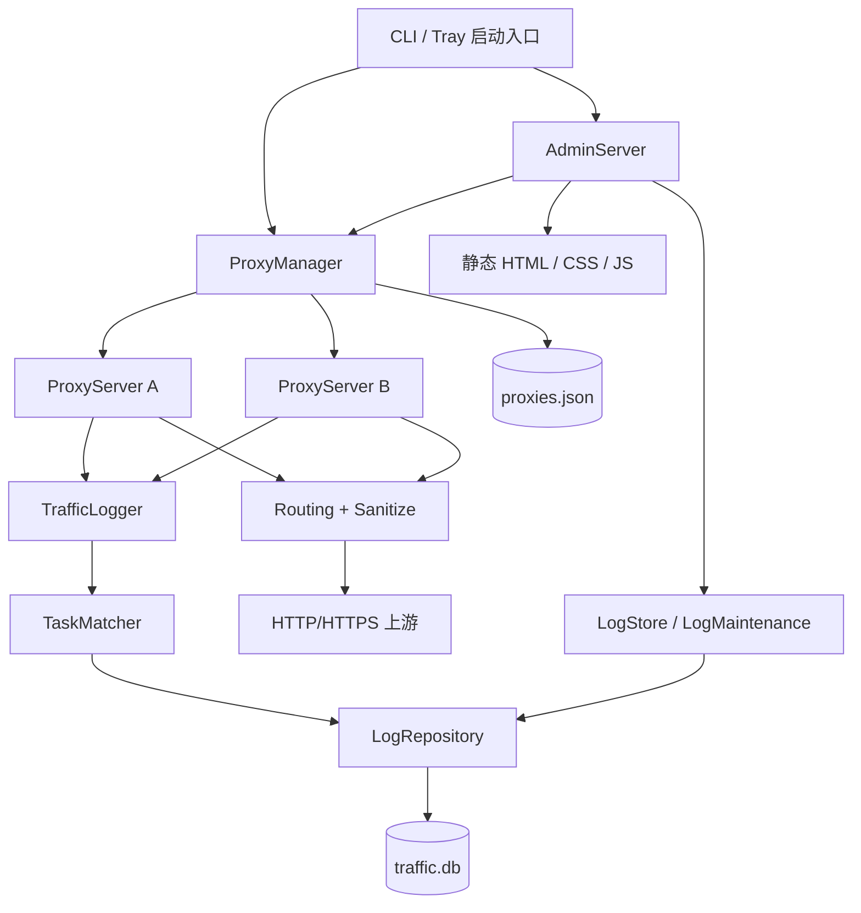
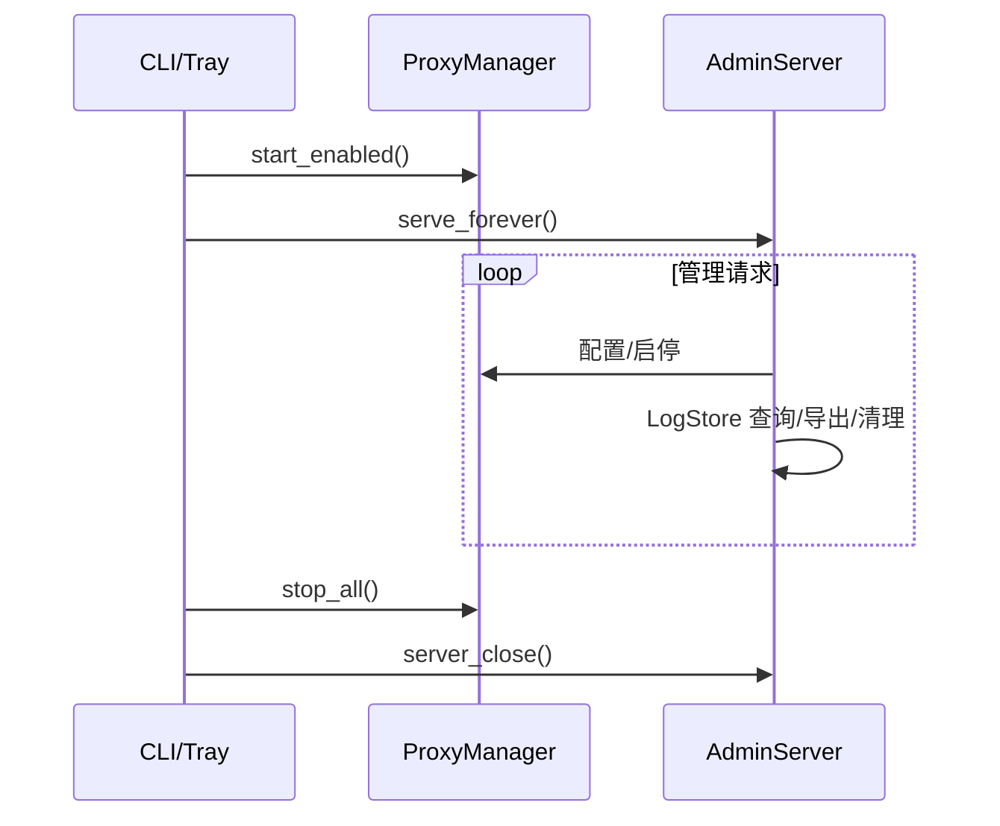
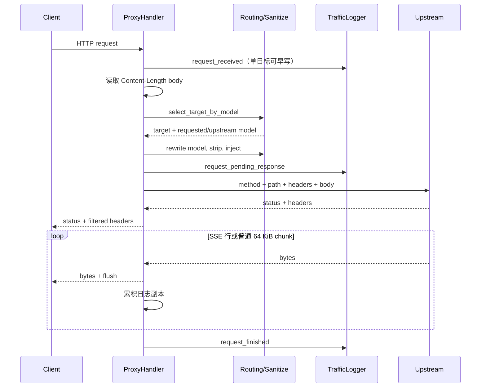
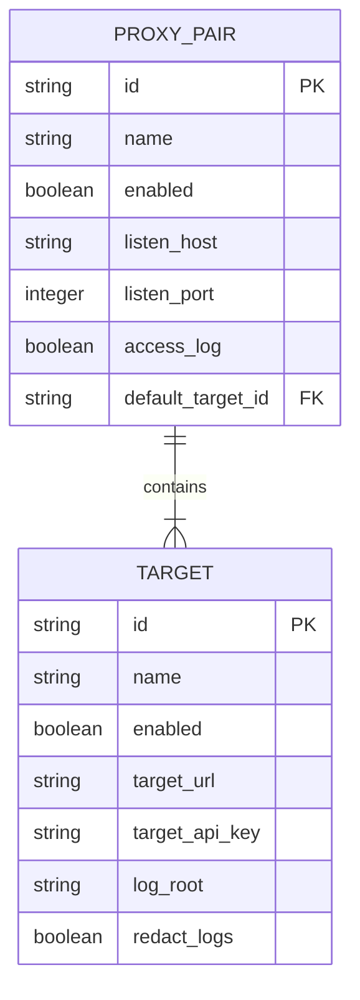
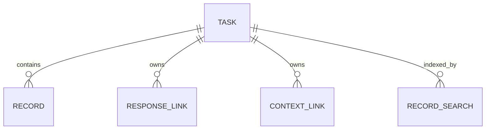
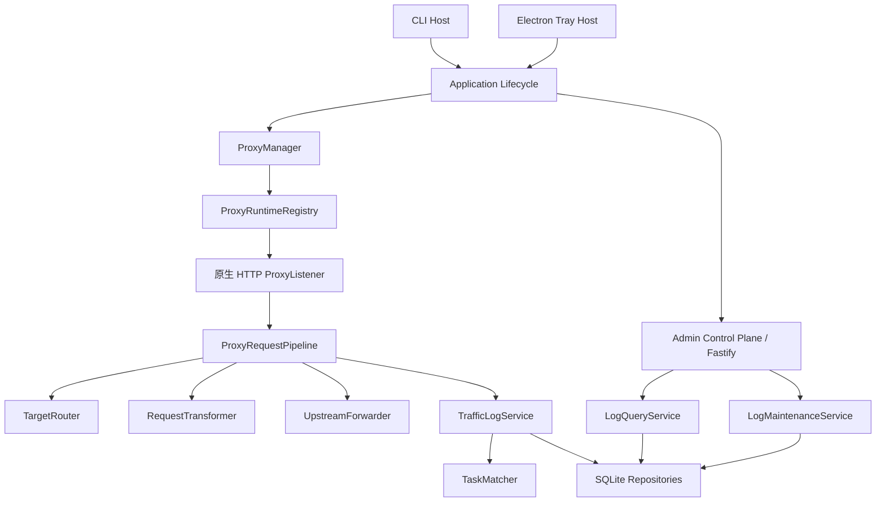

# LLM Proxy 模块设计文档

## 1. 文档范围

本文档描述：

1. 当前 Python 版本的模块边界、依赖关系、运行时数据流和存储设计。
2. Node.js/TypeScript 重构后的建议模块边界。
3. Python 模块到 Node.js 模块的迁移映射。

软件功能和用户行为详见[软件功能说明书](./software-functional-specification.md)。迁移步骤详见[Node.js 重构计划](./nodejs-refactoring-plan.md)。

## 2. 当前系统总体架构

当前系统是单进程、多线程架构。管理服务监听一个固定端口，每个启用的 proxy pair 创建一个独立 `ThreadingHTTPServer` 和后台线程，每个 HTTP 请求再由服务器创建请求线程。



### 2.1 分层

| 层 | 职责 | 当前模块 |
| --- | --- | --- |
| 启动与宿主 | 参数解析、浏览器、托盘、生命周期 | `cli.py`, `tray.py`, `__main__.py` |
| 管理应用 | 静态页面、管理 API、代理实例管理 | `admin_server.py`, `manager.py`, `ui.py` |
| 代理传输 | HTTP 接收、路由、Header、请求改写、响应流 | `server.py`, `routing.py`, `target.py`, `sanitize.py`, `http_utils.py` |
| 日志领域 | 记录规范化、任务匹配、摘要和脱敏 | `logger.py`, `records.py`, `task_matcher.py`, `streams.py`, `redaction.py`, `payloads.py` |
| 持久化 | SQLite schema、repository、读取、导出、清理 | `log_db.py`, `log_repository.py`, `log_store.py`, `log_maintenance.py`, `log_roots.py` |
| 通用基础 | 类型、常量、时间、原子文件 | `models.py`, `constants.py`, `time_utils.py`, `file_io.py` |
| 前端 | 双语代理配置与日志查看器 | `static/index.html`, `static/app.css`, `static/app.js` |

## 3. 当前模块详细设计

### 3.1 启动模块

#### `llm_proxy/__main__.py`

- `python -m llm_proxy` 入口。
- 调用 `cli.main()` 并把返回值作为进程退出码。

#### `llm_proxy/cli.py`

职责：

- 解析 `--host`、`--port`、`--config-file`、`--log-root`、`--no-browser`。
- 从对应环境变量读取默认值。
- 创建 `ProxyManager`。
- 可延迟 0.5 秒打开浏览器。
- 调用 `serve_admin()` 阻塞运行。
- 捕获 Ctrl+C 并正常退出。

依赖方向：`cli -> admin_server -> manager`。

#### `llm_proxy/tray.py`

职责：

- 创建 Windows/桌面托盘图标和菜单。
- 在后台线程运行 `AdminServer`。
- 启动已启用代理。
- 打开外部浏览器管理页面。
- 退出时按顺序停止管理服务和所有代理。
- 缺少 `pystray`/Pillow 时显示可理解错误。

设计特点：托盘是可选功能，核心代理不依赖托盘第三方包。

#### `llm_proxy/__init__.py`

- 聚合导出 manager、server、logger 和多组 helper，形成当前 Python import 面。
- 这些导出没有独立版本或兼容策略。Node.js 重构应只导出有明确使用场景的模块，不照搬 Python 聚合导出结构。

### 3.2 管理服务模块

#### `llm_proxy/admin_server.py`

`AdminHandler` 同时承担：

- 静态资源服务。
- JSON 管理 API 路由。
- JSON body 读取。
- 文本、JSON、二进制响应序列化。

`AdminServer` 保存两个共享对象：

- `manager: ProxyManager`
- `log_store: LogStore`

生命周期：



当前限制：路由通过 `if` 链实现，参数校验较弱，非法 JSON 被转换为空对象。

#### `llm_proxy/ui.py`

- 从 Python package resource 读取三个静态文件。
- 把建议删除字段列表序列化后替换 `app.js` 中占位符。
- 模块导入时形成 `INDEX_HTML`、`APP_CSS`、`APP_JS` 常量。

### 3.3 代理管理模块

#### `llm_proxy/manager.py`

`ProxyManager` 是配置与运行实例的聚合根。

内部状态：

```text
config_path: Path
log_root: Path | None
lock: RLock
pairs: ProxyPair[]
runtimes: Map<pair_id, ProxyRuntime>
```

核心职责：

- 加载、规范化、保存完整配置。
- 列出配置并附加运行态。
- 整体替换配置。
- 启动、停止、重启单个代理。
- 启动所有 `enabled=true` 的代理。
- 把持久化 TargetConfig 编译成 RuntimeTarget。

`ProxyRuntime` 持有：

- `ProxyServer`
- 后台 `Thread`
- 主 `TrafficLogger`

配置变更事务边界：先把新配置写入内存并保存文件，再停止/重启运行实例。若后续监听启动失败，配置已写入但运行态可能失败；管理 API 返回错误，当前没有配置回滚。

#### `llm_proxy/config.py`

- 提供默认配置路径、默认日志根和建议删除字段。
- 对 pair/target/model mapping 做宽松规范化。
- 保证 pair 至少一个 target。
- 保证 `default_target_id` 指向存在的 target。
- 将 object 类型的 inject 配置转为紧凑 JSON 字符串。

#### `llm_proxy/models.py`

通过 `TypedDict` 表达配置、运行时目标和记录形状。只提供静态检查，不提供运行时验证。

### 3.4 HTTP 代理模块

#### `llm_proxy/server.py`

`ProxyHandler` 是核心传输编排器，承担以下职责：

1. 接收请求和读取 body。
2. 生成 request ID 和初始日志。
3. 选择目标并改写请求。
4. 构造上游 Header 和路径。
5. 建立 HTTP/HTTPS 连接。
6. 流式转发上游响应。
7. 聚合响应 body。
8. 写入最终日志。

主流程：



`ProxyServer` 继承 `ThreadingHTTPServer`，关闭时去重并关闭所有 target logger，再关闭监听 socket。

设计问题：`ProxyHandler` 同时承担传输、路由编排和日志生命周期，职责偏重；Node.js 版本应拆分。

#### `llm_proxy/routing.py`

纯函数模块：

- `request_model_from_body`
- `select_target_by_model`
- `rewrite_request_model`

优点：无 I/O，已有独立测试，适合直接逐函数移植。

#### `llm_proxy/target.py`

- 校验目标 URL 只使用 HTTP/HTTPS。
- 解析 scheme、host、port 和 base path。
- 拼接基础路径与客户端请求路径，并防止重复前缀。

#### `llm_proxy/sanitize.py`

- 解析逗号分隔删除字段。
- 校验注入内容必须是 JSON object。
- 先删除后注入，只处理顶层 JSON object。

#### `llm_proxy/http_utils.py`

- 把重复 Header 转成 `name -> values[]`。
- 解析 `Name: value` 自定义 Header。

### 3.5 日志领域模块

#### `llm_proxy/logger.py`

`TrafficLogger` 是写日志的应用服务，内部串联：

```text
TrafficRecord
  -> optional redact_record
  -> TaskMatcher.assign
  -> upsert_task
  -> upsert_record
  -> upsert_response_link/context_link
```

每个 logger 使用 `RLock` 串行化一次完整写入流程。若 `log_root=None`，repository 和 matcher 均为空，写入成为 no-op。

`_record_row()` 将传输层 TrafficRecord 转成数据库领域记录，并计算 endpoint、message_count、token_count。

#### `llm_proxy/records.py`

纯领域解析模块，职责包括：

- endpoint 类型识别。
- JSON body 提取。
- 消息数和 Token 数统计。
- 各 API 请求的稳定内容摘要。
- SHA-256 短指纹。
- system、first user、user sequence、tools、input/messages 指纹。
- 固定 Codex 上下文消息排除。
- response ID 提取。

这是任务归并正确性的核心依赖。

#### `llm_proxy/task_matcher.py`

TaskMatcher 负责将 record 分配给 task。

领域对象 `TaskAssignment` 包含：

- task
- sequence
- kind
- request/response payload
- response IDs
- context keys

匹配策略版本当前为 4。策略由显式 link 匹配和 24 小时启发式匹配组成。匹配会读取 repository 最近任务，因此它不是纯函数。

#### `llm_proxy/streams.py`

负责把 SSE 多事件压缩为单个结构化摘要。`StreamAccumulator` 根据 event type 分派到：

- Responses event handler
- Claude event handler
- Chat Completions handler

内部维护 content、reasoning、三类 tool calls、web search calls、finish reasons、usage、response metadata 和无法识别 payload。

#### `llm_proxy/payloads.py`

- 将 bytes 包装为 size/base64/text。
- JSON pretty print。
- 调用 stream compactor。
- 把 body 转成 SQLite/导出的 JSON 值。

#### `llm_proxy/redaction.py`

深拷贝记录后，对 request/response Header 和 JSON body 递归脱敏。仅当 body text 可解析为 JSON 时处理内容。

### 3.6 持久化模块

#### `llm_proxy/log_db.py`

SQLite 连接参数：

```text
journal_mode = WAL
foreign_keys = ON
busy_timeout = 5000 ms
synchronous = NORMAL
check_same_thread = false
```

数据库 schema version 为 1。

#### `llm_proxy/log_repository.py`

repository 封装所有 SQL 和 JSON 字段编码/解码：

- task/record upsert 和读取。
- response/context link upsert 和查找。
- task/record 分页。
- recent task 查询。
- task 级联删除。
- 搜索文本写入和 LIKE 检索。

每个 repository 持有一个 SQLite connection 和一个 `RLock`。管理端查询通常为每次操作临时创建连接，写入 logger 长期持有连接。

#### `llm_proxy/log_store.py`

管理 API 面向 UI 的查询适配层：

- 跨 log root 合并任务。
- 将 task 转成 UI group summary。
- 将 record 转成 UI list item 和 detail DTO。
- 将 ISO 时间格式化为本地显示时间。

#### `llm_proxy/log_maintenance.py`

- 全量遍历 task 和 record。
- 内存生成 ZIP。
- 生成 task/record Markdown。
- 按 task ID、时间或保留数量删除。

#### `llm_proxy/log_roots.py`

从所有 target 配置中提取、去重非空日志根；没有 target log root 时回退到 manager 默认根。

### 3.7 通用模块

| 模块 | 职责 |
| --- | --- |
| `constants.py` | hop-by-hop Header、默认端口、建议删除字段 |
| `file_io.py` | 小文本文件原子写入 |
| `time_utils.py` | 带本地时区 ISO 时间、显示/文件名格式化 |

### 3.8 仓库辅助文件

| 路径 | 作用 | 重构处理 |
| --- | --- | --- |
| `examples/responses_client.py` | OpenAI Python SDK 请求示例 | 改为 Node.js OpenAI SDK 示例；修复已失效的 `--target-url` 注释 |
| `run.bat` | Windows 命令行启动 | 改为 Node CLI 或启动已打包程序 |
| `tray_launcher.py` | PyInstaller 托盘入口 | 由 Electron main 取代 |
| `.github/workflows/ci.yml` | Windows Python 3.10/3.12 质量检查 | 迁移期保留，最终改为 Node 24 多层测试 |
| `.github/workflows/release.yml` | PyInstaller exe、checksum、GitHub Release | 改为 electron-builder/CLI artifact |
| `README.md`, `README.cn.md` | 双语用户说明 | 正式切换时完整改写运行和开发命令 |
| `doc/ui_*.png` | 中英文 UI 截图 | 作为视觉回归基线，必要时更新 |
| `.gitignore` | 排除 logs、Python cache/build | 增加 node_modules、coverage、Node/Electron build 输出并移除陈旧项 |

## 4. 当前前端模块设计

前端是单页、无构建步骤的原生 JavaScript 应用。

### 4.1 HTML

静态定义：

- Header、Tab 和语言选择。
- Proxy toolbar 和动态 card 容器。
- History 左侧列表、左右 splitter、Request/Response JSON pane。
- Toast。

### 4.2 CSS

- CSS 变量定义颜色和动态布局尺寸。
- Proxy target 使用响应式网格，空间不足时自动换行。
- History 使用三列 grid：sidebar、splitter、detail。
- Detail 使用三行 grid：request、splitter、response。
- JSON tree 使用 `details/summary`；`.json-pane` 使用 `contain: layout`，限制普通布局变化的重排影响范围。
- 760 px media query 切换窄屏布局。

### 4.3 JavaScript 状态

全局 `state` 包含：

- language、pairs。
- task groups、展开/加载状态、分页状态。
- selected record。
- request/response raw、meta、meta 展开、wrap、tree、format string 状态。
- 搜索和自动刷新 timer。

前端没有路由器或组件框架，使用模板字符串整块重绘。为了防止重绘丢失输入，语言切换和部分操作前先调用 `collectPairs()` 回收 DOM 值。

task records API 保留单次最多 200 条的边界，避免一个长期 task 生成无界管理端响应。响应同时返回 `total`、`limit` 和 `has_more`，不再静默隐藏截断状态；当前 UI 继续显示最新 200 条。

Splitter 拖动（左右分栏与上下分栏）采用“预览后提交”：pointerdown 时缓存容器和原始分栏尺寸，pointermove 只通过 `transform` 移动 splitter 预览线，不改变 grid 尺寸，因此大 JSON DOM 不参与拖动过程中的重排；pointerup 时才一次性提交新的 CSS 分栏变量。拖动期间置位 `state.splitterDragging`，跳过周期性自动刷新，避免列表 DOM 重建干扰交互。

分栏提交后不重新生成 JSON DOM。浏览器直接按现有节点完成一次布局，保留所有 `details` 展开状态和滚动位置，也避免松手后因 `innerHTML` 替换产生界面闪烁。JSON pane 在用户主动切换树形、格式化、换行等显示选项时，仍会先预扫描长字符串并批量测量宽度，把原来逐字符串触发的同步布局合并为一次。

## 5. 当前数据模型

### 5.1 配置聚合



配置实际存储为 JSON 嵌套结构，不是关系表。

### 5.2 SQLite 关系



#### `tasks`

字段分组：

- 标识：`id`, `kind`, `endpoint`, `anchor`。
- 业务：`model`, `target`。
- 时间：`started_at`, `last_seen_at`, `last_response_at`。
- 状态：`request_count`, `pending_request_only`, `match_confidence`, `match_strategy_version`。
- 归并证据：`fingerprints_json`, `boundary_fingerprints_json`, `last_user_messages_json`。
- 审计：`created_at`, `updated_at`。

#### `records`

字段分组：

- 标识与关系：`id`, `task_id`, `sequence`，并有 `UNIQUE(task_id, sequence)`。
- 生命周期：`event`, `timestamp`, `started_at`, `first_byte_ms`, `duration_ms`。
- 来源：proxy/client/target 字段。
- HTTP：method/path/endpoint/status/error。
- 摘要：message_count/token_count。
- 内容：request/response headers 和 body JSON。
- 改写：model_route、stripped/injected fields、added upstream headers。
- 审计：created_at/updated_at。

#### `response_links`

将上游 response ID 唯一映射到 task。

#### `context_links`

将 `prefix:value` 上下文 key 唯一映射到 task。

#### `body_chunks` / `record_body_chunks`

请求、原始请求和响应正文按 64 KiB 切块，以 SHA-256 寻址、raw DEFLATE 压缩并跨记录去重；引用表
保留块顺序，删除记录时通过引用计数回收不再使用的块。

#### `record_search_fts` / `record_search_map`

contentless FTS5 虚表只保存倒排索引，映射表保存 record/task 关系，不再复制完整搜索正文。

## 6. 当前并发与资源管理

### 6.1 并发模型

- AdminServer：一个请求一个线程。
- 每个 ProxyServer：独立 serve_forever 线程。
- 每个代理请求：独立处理线程。
- 每个 TrafficLogger：RLock 串行 DB 写入。
- 每个 LogRepository：RLock 保护同一连接。

### 6.2 关闭顺序

1. 停止接受管理请求。
2. `ProxyManager.stop_all()`。
3. 对每个 proxy 调用 `shutdown()`。
4. 关闭并去重 TrafficLogger/SQLite connection。
5. join proxy thread，最多等待 2 秒。
6. 关闭 AdminServer。

### 6.3 失败行为

- 单个上游失败返回/记录 502，不终止其他请求。
- 某代理监听端口冲突会使启动或配置保存请求失败。
- 配置替换过程中没有整体事务和运行时回滚。
- SQLite busy timeout 后的错误会沿调用栈传播；代理日志写入异常目前可能影响请求处理流程。

## 7. Node.js 目标架构

### 7.1 技术基线

- Node.js 24 LTS。
- TypeScript，ESM，严格模式。
- 原生 `node:http` / `node:https` 实现代理数据面，直接使用 Node stream/backpressure。
- 管理端可使用轻量 HTTP 框架；建议 Fastify，仅承载控制面和静态资源。
- SQLite 使用 `better-sqlite3`，由单进程 repository 管理事务；通过写队列避免并发重入。
- 运行时校验使用 Zod。
- 测试使用 Vitest；HTTP 集成测试使用 Node 原生 client 或 undici。
- Windows 托盘使用独立 Electron host，并用 electron-builder 打包；核心服务保持普通 Node 模块，可独立 CLI 运行。
- 前端第一阶段原样复用现有 HTML/CSS/JS，不引入 React/Vue。

选择原生 HTTP 数据面的原因：代理需要保持 Header、状态、字节流、SSE 延迟和 backpressure；通用 Web 框架不应接管或缓冲模型响应。

### 7.2 目标运行结构



### 7.3 建议目录

```text
src/
  main.ts
  app/
    application.ts
    shutdown.ts
  cli/
    args.ts
    browser.ts
  config/
    config-schema.ts
    config-normalizer.ts
    config-repository.ts
    defaults.ts
  admin/
    admin-server.ts
    routes/
      pairs.ts
      logs.ts
    dto.ts
  proxy/
    proxy-manager.ts
    proxy-runtime-registry.ts
    proxy-listener.ts
    proxy-request-pipeline.ts
    target-router.ts
    request-transformer.ts
    upstream-forwarder.ts
    headers.ts
    target-url.ts
  logging/
    traffic-log-service.ts
    record-analyzer.ts
    task-matcher.ts
    stream-summary.ts
    redaction.ts
    payload.ts
  persistence/
    database.ts
    migrations/
      001-initial.ts
    task-repository.ts
    record-repository.ts
    link-repository.ts
    log-query-repository.ts
  maintenance/
    log-export.ts
    log-cleanup.ts
    log-roots.ts
  ui/
    static/
      index.html
      app.css
      app.js
  shared/
    errors.ts
    time.ts
    ids.ts
    types.ts
electron/
  main.ts
  tray.ts
tests/
  unit/
  integration/
  parity/
```

### 7.4 目标模块职责

#### Application Lifecycle

- 组合 config repository、DB factory、manager 和 admin server。
- 捕获 SIGINT、SIGTERM、uncaught error。
- 保证只执行一次幂等关闭。
- 对启用代理启动失败提供结构化结果，不让部分状态静默丢失。

#### ConfigRepository

- 只负责文件读取/原子保存。
- 使用 Zod 校验，再由 normalizer 补默认值。
- 区分“文件不存在”和“文件损坏”。
- 支持读取现有 Python 版 JSON。

#### ProxyManager / ProxyRuntimeRegistry

- Manager 管理配置意图。
- Registry 管理实际 listener 资源。
- `applyConfiguration()` 先验证所有配置，再计算 add/update/remove diff。
- 对同地址冲突提前检查。
- 失败时返回逐代理结果；是否回滚由计划阶段 ADR 决定。

#### ProxyRequestPipeline

编排而不实现细节：

```text
create pending record
-> collect/tee request body
-> choose target
-> transform request
-> open upstream
-> pipe response with backpressure
-> collect bounded or spooled log copy
-> finalize record
```

#### UpstreamForwarder

- 原样支持 HTTP/HTTPS。
- 正确处理 incoming chunked body。
- 使用 `stream.pipeline()` 和 backpressure。
- 不设置上游响应超时；请求截止时间由客户端控制。
- 支持 AbortController：客户端断开和应用关闭。
- 保留当前 `Connection: close` 合同作为 parity 阶段默认行为；性能优化另做变更。

#### TrafficLogService

- 日志失败不得破坏已正常进行的代理响应。
- 单个请求的 task、record 和 links 在一个 SQLite transaction 中写入。
- 通过 per-database queue 串行写入。
- 明确 original body 和 upstream body 的存储合同。

#### LogQueryService

- 组合多个日志根的查询结果。
- DTO 与 repository row 解耦。
- 保持搜索和分页语义。

#### StreamSummary

- 纯函数/小型状态机。
- 每种协议使用独立 accumulator adapter。
- 未知事件不影响已知事件摘要。
- 增加流式增量摘要接口，避免只能在响应结束后重新解析全部文本。

#### Electron Tray Host

- 仅负责 Tray、菜单、打开浏览器和核心应用生命周期。
- 不包含业务逻辑。
- Exit 必须 await 核心关闭完成后退出进程。

## 8. Python 到 Node.js 模块映射

| Python 模块 | Node.js 目标模块 | 迁移方式 |
| --- | --- | --- |
| `cli.py`, `__main__.py` | `main.ts`, `cli/*` | 重写参数和信号处理 |
| `tray.py`, `tray_launcher.py` | `electron/*` | 用 Electron Tray 重写 |
| `admin_server.py` | `admin/admin-server.ts`, `admin/routes/*` | 路由拆分并加入 schema |
| `manager.py` | `proxy/proxy-manager.ts`, `proxy-runtime-registry.ts` | 拆分配置意图和运行资源 |
| `config.py`, `models.py` | `config/*`, `shared/types.ts` | Zod + inferred TypeScript types |
| `server.py` | `proxy/proxy-listener.ts`, `proxy-request-pipeline.ts`, `upstream-forwarder.ts` | 按职责拆分，使用 Node streams |
| `routing.py` | `proxy/target-router.ts` | 逐函数等价移植 |
| `target.py` | `proxy/target-url.ts` | 使用 WHATWG URL，保留路径测试 |
| `sanitize.py` | `proxy/request-transformer.ts` | 等价移植并增加契约测试 |
| `http_utils.py`, `constants.py` | `proxy/headers.ts` | 保留重复 Header 与覆盖优先级 |
| `logger.py` | `logging/traffic-log-service.ts` | 加事务、隔离日志错误 |
| `records.py` | `logging/record-analyzer.ts` | 逐测试移植 |
| `task_matcher.py` | `logging/task-matcher.ts` | 保持策略版本 4 和数据证据 |
| `streams.py` | `logging/stream-summary.ts` | 移植状态机并支持增量输入 |
| `redaction.py` | `logging/redaction.ts` | 深拷贝/不可变变换 |
| `payloads.py` | `logging/payload.ts` | 明确原始 bytes 与解析值 |
| `log_db.py` | `persistence/database.ts`, `migrations/*` | 引入显式 migration runner |
| `log_repository.py` | `persistence/*-repository.ts` | 按实体和查询职责拆分 |
| `log_store.py` | `maintenance/log-query-service.ts` | DTO 适配 |
| `log_maintenance.py` | `maintenance/log-export.ts`, `log-cleanup.ts` | ZIP 改为流式输出 |
| `log_roots.py` | `maintenance/log-roots.ts` | 纯函数移植 |
| `file_io.py` | `config/config-repository.ts` | temp + fsync + rename |
| `time_utils.py` | `shared/time.ts` | ISO 带 offset，显示用本地时区 |
| `static/*` | `src/ui/static/*` | 第一阶段原样复制 |

## 9. 目标设计关键合同

### 9.1 必须稳定的外部合同

- 本地代理的 HTTP 字节和流式时序。
- 配置字段语义和默认路径。
- 现有 SQLite 数据可读。
- 用户可见 UI 功能与视觉。
- CLI 环境变量。
- task grouping 行为。

### 9.2 可自由调整的内部合同

根据项目 AGENTS.md，内部 API 不要求兼容。以下可直接采用最简单当前设计：

- TypeScript 内部 class/function 签名。
- repository 拆分方式。
- admin API DTO，只要同步更新当前 UI 且无需保留 Python 内部兼容层。
- 配置 normalizer 内部结构。
- logger 内部事件对象。

### 9.3 建议保留但不做兼容 shim 的合同

- 第一阶段保留现有 `/api/*` 路径，因为前端原样复用且合同简单。
- 若后续简化 API，应一次性同步更新 UI 和测试，不实现双版本路由。

## 10. 待决设计事项

以下事项必须在实现前形成 ADR：

1. SQLite 驱动最终选择 `better-sqlite3` 还是 Node 内置 `node:sqlite`。
2. 是否在 schema v2 同时保存 original request body 和 upstream request body。
3. 日志 body 的内存上限，以及超过上限时截断、落临时文件还是禁用正文日志。
4. 客户端断开后是否继续读取上游并完成日志，还是立即 abort。
5. 配置应用失败时采用整体回滚还是允许部分代理成功。
6. Windows 交付物是 Electron portable exe、安装包，还是 CLI 单文件加托盘安装包两种产物。
7. 是否继续强制 `Connection: close`，以及何时引入 keep-alive agent。
8. 搜索保持 LIKE 语义还是迁移到真正 FTS MATCH；若改变，应更新搜索规格和 UI 提示。

## 11. 设计验收原则

- 数据面优先：流式代理不能被控制面框架缓冲。
- 日志旁路：日志失败不能改变上游成功响应。
- 先 parity 后优化：视觉、API、数据和任务归并先等价，再单独做性能/体验变更。
- 单向依赖：transport 不依赖 admin，domain 不依赖 UI，repository 不反向依赖 service。
- 可测试：routing、transform、redaction、record analysis、stream summary 尽量保持纯函数。
- 可关闭：所有 listener、socket、timer、DB 和 Electron 资源必须可追踪、可幂等关闭。
